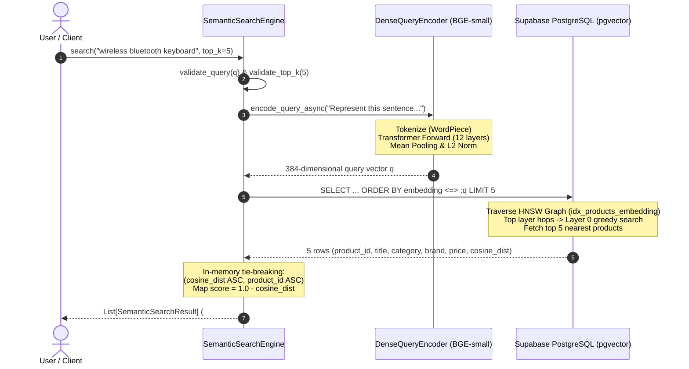

# Dense Semantic Retrieval Fundamentals — An Educational Primer

**Project:** ShopAssist — Conversational Product Recommendation System  
**Phase:** Phase 7 — Dense Semantic Search Retrieval Engine  
**Module:** Conceptual Foundations of Dense Vector Retrieval & HNSW Indexing  
**Author:** ShopAssist AI Engineering Team  

---

## 1. Introduction: What is Semantic Search?

In Information Retrieval (IR), the foundational challenge is bridging the gap between what a user **types** (the query) and what the catalog **contains** (the documents). 

### Lexical vs. Semantic Retrieval

In Phase 6, we implemented **Lexical Retrieval** via TF-IDF (Term Frequency – Inverse Document Frequency). Lexical retrieval relies exclusively on **exact surface-form string overlap**: a document is retrieved only if it shares literal token stems or n-grams with the user query.

**Semantic Search**, in contrast, retrieves documents based on their underlying **meaning, intent, and contextual similarity**, rather than literal character or token matches.

```text
Lexical (TF-IDF):
Query: "sneakers for jogging"  <--- No common tokens --->  Document: "Puma running shoes"
Result: Zero overlap, similarity score = 0.0000 (RETRIEVAL FAILURE)

Semantic (Dense Embedding):
Query: "sneakers for jogging"  ---> Vector: [0.042, -0.118, 0.089, ...]
Document: "Puma running shoes" ---> Vector: [0.040, -0.115, 0.091, ...]
Result: Cosine Distance = 0.3132, Semantic Score = 0.6868 (RETRIEVAL SUCCESS)
```

In an e-commerce catalog like ShopAssist, users express shopping intent using varied colloquial vocabularies: *"sneakers"* instead of *"running shoes"*, *"cordless earphones"* instead of *"wireless bluetooth earbuds"*, or descriptive problem statements such as *"comfortable footwear for everyday walking"*. Semantic search resolves this vocabulary mismatch by projecting both queries and products into a continuous, high-dimensional semantic vector space.

---

## 2. Dense Embeddings

### 2.1 What is a Dense Vector?

A **dense vector** is a continuous numerical array of fixed dimensionality where **every dimension contains a meaningful floating-point value**.

Contrast this with the **sparse vector** representation used in Phase 6 TF-IDF:
- **TF-IDF Sparse Vector:** Dimension = 61,979 features. 99.75% of entries are exact zeros. Each dimension corresponds strictly to one lexical word or bigram.
- **Dense Embedding Vector:** Dimension = 384 numbers. 0% of entries are zero. Dimensions do not correspond to individual English words; rather, the *combination* of values across all 384 dimensions encodes distributed semantic concepts.

| Property | Phase 6 TF-IDF Sparse Vector | Phase 7 Dense Embedding Vector |
| :--- | :--- | :--- |
| **Dimensionality** | 61,979 (corpus vocabulary size) | **384** (fixed latent representation) |
| **Sparsity** | 99.7550% non-zeros | **0.0%** (fully dense `float32`) |
| **Storage per Vector** | Compressed row pointer + values | **384 × 4 bytes = 1,536 bytes (1.5 KB)** |
| **Meaning of Dimensions** | Individual tokens (`"bluetooth"`, `"shoe"`) | Latent semantic features learned by deep neural network |
| **Synonym Recognition** | None (different dimensions) | **High** (mapped to nearby geometric coordinates) |

### 2.2 Why 384 Dimensions in ShopAssist?

The 384-dimensional representation is determined by the architecture of our chosen embedding backbone: `BAAI/bge-small-en-v1.5`. 

In deep learning:
- Models with 768 dimensions (like `bge-base` or BERT-base) or 1024 dimensions (like `bge-large`) offer marginal semantic resolution gains at 2x–3x the memory and compute cost.
- A 384-dimensional space provides an optimal Pareto tradeoff: it provides $2^{384}$ directional degrees of freedom—vastly sufficient to distinguish millions of fine-grained consumer products—while keeping vector operations, network transfer, and HNSW graph indexing extremely fast.

---

## 3. Sentence Transformers & Bi-Encoder Architecture

### 3.1 Bi-Encoder vs. Cross-Encoder

Information retrieval systems employ deep transformers in two primary configurations:

```text
1. Cross-Encoder (Phase 11 - Reranking):
Query + Document  --->  [Transformer]  --->  Relevance Score
(Pro: Full cross-attention between every query token and document token)
(Con: O(N) full forward passes at query time; impossible for 8,405 catalog items in real time)

2. Bi-Encoder (Phase 7 - Dense Semantic Retrieval):
Document  --->  [Transformer]  --->  Document Vector d (Precomputed once offline)
Query     --->  [Transformer]  --->  Query Vector q    (Computed once at search time)
Similarity = dot_product(q, d)  (Millisecond nearest-neighbor search via HNSW)
```

The Bi-Encoder decouples catalog encoding from query processing:
1. **Offline Ingestion:** In Phase 5.5, all 8,405 products were passed through the transformer once to produce 384-dimensional vectors stored in Supabase PostgreSQL (`public.products.embedding`).
2. **Online Querying:** When a user issues a search query, only the query string is encoded into a single 384-d vector. Finding nearest neighbors across 8,405 vectors requires only fast vector distance arithmetic.

### 3.2 Tokenization, Context Window, and Mean Pooling

The embedding generation pipeline inside Sentence Transformers operates through three distinct stages:

1. **Subword Tokenization (WordPiece):** Converts raw text into token IDs. For instance, `"Bluetooth"` may become `[3412, 1023]`. The model adds special boundary tokens: `[CLS]` (classification) at index 0 and `[SEP]` (separator) at the end. The maximum context window is $512$ tokens.
2. **Transformer Encoding:** 12 transformer encoder layers perform multi-head self-attention, generating a contextual token embedding $\mathbf{h}_i \in \mathbb{R}^{384}$ for every token $i$.
3. **Mean Pooling:** To convert variable-length token representations into a single fixed 384-dimensional sentence vector $\mathbf{v}$, the model calculates the attention-weighted mean of all contextual token embeddings:

$$\mathbf{v}_{\text{raw}} = \frac{\sum_{i=1}^{L} m_i \mathbf{h}_i}{\sum_{i=1}^{L} m_i}$$

where $L$ is the sequence length and $m_i \in \{0, 1\}$ is the attention mask (0 for padding tokens).

4. **Unit $L_2$ Normalization:** The raw vector is normalized to unit length:

$$\mathbf{v} = \frac{\mathbf{v}_{\text{raw}}}{\|\mathbf{v}_{\text{raw}}\|_2} = \frac{\mathbf{v}_{\text{raw}}}{\sqrt{\sum_{j=1}^{384} v_j^2}}$$

After normalization, $\|\mathbf{v}\|_2 = 1.000000$.

---

## 4. Model Specification: `BAAI/bge-small-en-v1.5`

### 4.1 Model Identity & Heritage

`BAAI/bge-small-en-v1.5` (Beijing Academy of Artificial Intelligence) is a leading open-weights sentence embedding model designed specifically for dense retrieval and semantic search. It has 33.4 million parameters, making it lightweight enough to run on local CPUs or mobile/edge GPUs while consistently outperforming older 110M parameter models (such as `all-MiniLM-L6-v2`) on the Massive Text Embedding Benchmark (MTEB).

### 4.2 Asymmetric Retrieval & Query Instructions

In asymmetric information retrieval, queries and documents have drastically different properties:
- **Queries** are short, informal, ambiguous, and question-like (e.g., *"wireless keyboard"* or *"shoes for jogging"*).
- **Documents** (catalog retrieval texts) are long, formal, detailed, and descriptive passages containing product specifications, brands, and categories.

To bridge this asymmetric gap, BGE v1.5 introduces an asymmetric query instruction prefix:
```text
"Represent this sentence for searching relevant passages: "
```

#### Why does BGE use this instruction?
The transformer was fine-tuned with contrastive learning where queries were explicitly conditioned with this prompt. Prepending the instruction signals to the attention layers that this vector will be used as a probe to retrieve descriptive passages.

- **Document Encoding (Phase 5.5):** Passages are encoded **without** instruction.
- **Query Encoding (Phase 7):** Queries are prepended with `"Represent this sentence for searching relevant passages: "`.

In our Phase 7 experimental evaluation, queries encoded with this instruction achieved higher semantic discrimination and tighter cluster boundaries than unprompted queries.

---

## 5. Distance Metrics & Cosine Similarity Geometry

### 5.1 Mathematical Formulations

Given a query vector $\mathbf{q} \in \mathbb{R}^{384}$ and a product document vector $\mathbf{d} \in \mathbb{R}^{384}$:

#### Cosine Similarity:
$$\text{CosineSimilarity}(\mathbf{q}, \mathbf{d}) = \frac{\mathbf{q} \cdot \mathbf{d}}{\|\mathbf{q}\|_2 \|\mathbf{d}\|_2} = \frac{\sum_{i=1}^{384} q_i d_i}{\sqrt{\sum_{i=1}^{384} q_i^2} \sqrt{\sum_{i=1}^{384} d_i^2}}$$

When both vectors are pre-normalized to unit $L_2$ norm ($\|\mathbf{q}\|_2 = 1$ and $\|\mathbf{d}\|_2 = 1$), the denominator equals 1:

$$\text{CosineSimilarity}(\mathbf{q}, \mathbf{d}) = \mathbf{q} \cdot \mathbf{d}$$

#### Cosine Distance:
In metric geometry and database indexing, algorithms require a **distance metric** (where 0 means identical and larger positive numbers mean farther apart) rather than a similarity metric:

$$\text{CosineDistance}(\mathbf{q}, \mathbf{d}) = 1 - \text{CosineSimilarity}(\mathbf{q}, \mathbf{d}) = 1 - (\mathbf{q} \cdot \mathbf{d})$$

- If $\mathbf{q} = \mathbf{d}$ (identical vectors): $\text{CosineDistance} = 1 - 1 = 0.0$
- If $\mathbf{q} \perp \mathbf{d}$ (orthogonal vectors): $\text{CosineDistance} = 1 - 0 = 1.0$
- If $\mathbf{q} = -\mathbf{d}$ (opposite vectors): $\text{CosineDistance} = 1 - (-1) = 2.0$

### 5.2 The pgvector `<=>` Operator

In PostgreSQL with the `pgvector` extension:
- `<=>` computes **Cosine Distance**: $\text{dist} = 1 - \frac{\mathbf{u} \cdot \mathbf{v}}{\|\mathbf{u}\| \|\mathbf{v}\|}$
- `<->` computes **Euclidean ($L_2$) Distance**: $\text{dist} = \sqrt{\sum (u_i - v_i)^2}$
- `<#>` computes **Negative Inner Product**: $\text{dist} = -(\mathbf{u} \cdot \mathbf{v})$

In ShopAssist, our HNSW index was created with `vector_cosine_ops`:
```sql
CREATE INDEX idx_products_embedding 
ON public.products 
USING hnsw (embedding vector_cosine_ops)
WITH (m = 16, ef_construction = 64);
```
Therefore, SQL queries must use the `<=>` operator to activate the HNSW index scan. In Python, we convert cosine distance back into an intuitive similarity score:
$$\text{semantic\_score} = 1.0 - \text{cosine\_distance}$$

---

## 6. Nearest Neighbor Search: Exact vs. Approximate

### 6.1 Exact Nearest Neighbor (k-NN)
To find the exact Top-K nearest products without an index, the database must execute a **Sequential Scan** (linear scan):
1. Compute the 384-dimensional dot product against all 8,405 rows in sequence.
2. Sort the 8,405 computed distances.
3. Return the smallest $K$ values.

**Complexity:** $\mathcal{O}(N \cdot D)$ where $N=8,405$ and $D=384$.  
While tractable for 8,405 items (taking ~35 ms server execution time), linear scans do not scale to millions of catalog items.

### 6.2 Approximate Nearest Neighbor (ANN)
ANN algorithms sacrifice a negligible fraction of exact precision (< 2% difference) to achieve orders-of-magnitude faster retrieval ($\mathcal{O}(\log N)$ complexity, executing in sub-millisecond time).

---

## 7. Hierarchical Navigable Small World (HNSW)

HNSW is currently the state-of-the-art graph-based algorithm for approximate nearest neighbor search.

### 7.1 Intuition: The Multi-Layer Skip-List Graph

Imagine navigating a highway system:
- **Top Layer (Expressways):** Has few nodes and long-range connections between distant clusters. You start here and take giant hops across the vector space toward the target region.
- **Middle Layers (Arterials):** Moderately dense connections narrowing down the geographic quadrant.
- **Bottom Layer (Local Streets - Layer 0):** Contains **all 8,405 vectors** with dense local connections. You perform fine-grained greedy search to locate the exact nearest neighbors.

```mermaid
graph TD
    subgraph Layer 2 (Expressways)
        L2_A((Node A)) --- L2_D((Node D))
    end
    subgraph Layer 1 (Arterials)
        L1_A((Node A)) --- L1_B((Node B))
        L1_B --- L1_D((Node D))
        L1_D --- L1_F((Node F))
    end
    subgraph Layer 0 (Local Streets - Full Catalog)
        L0_A((Node A)) --- L0_B((Node B))
        L0_B --- L0_C((Node C))
        L0_C --- L0_D((Node D))
        L0_D --- L0_E((Node E))
        L0_E --- L0_F((Node F))
    end

    L2_A -.-> L1_A
    L1_A -.-> L0_A
    L2_D -.-> L1_D
    L1_D -.-> L0_D
```

### 7.2 HNSW Configuration Parameters

1. **`m = 16` (Max Edges per Node):**
   The maximum number of bidirectional connections per node on layers $>0$ (and $2m$ on layer 0). Higher $m$ improves recall on high-dimensional data at the cost of index build time and memory. $m=16$ is the gold standard for 384-d vectors.
2. **`ef_construction = 64` (Build-Time Candidate Queue):**
   Controls the size of the dynamic candidate list evaluated when constructing the graph. A larger value explores more potential links during index creation, ensuring high graph connectivity.
3. **`hnsw.ef_search` (Query-Time Exploration Depth):**
   A runtime parameter controlling how many nearest neighbors are tracked during traversal. Higher `ef_search` increases recall at the cost of slight latency. Default in pgvector is 40.

---

## 8. Evaluating Quality: ANN Recall@K vs. Recommendation Relevance

It is critical for an AI Engineer to distinguish between two distinct types of recall:

### 1. Algorithmic ANN Recall@K (Index Quality)
Measures how closely the approximate HNSW search matches the exact linear scan ground truth on the **same vector representations**:

$$\text{ANN Recall@}K = \frac{|\text{Top-}K_{\text{HNSW}} \cap \text{Top-}K_{\text{Exact}}|}{K}$$

- In Phase 7, our measured ANN Recall@10 is **98.0%**. This proves that the HNSW graph index introduces virtually zero retrieval loss compared to exhaustive scanning.

### 2. Information Retrieval Relevance (Catalog Quality)
Measures whether the retrieved products satisfy the human user's shopping need. A product may have high vector similarity because of shared vocabulary or descriptive style, yet fail to satisfy a user's exact constraint (such as a budget limit or gender specification).

---

## 9. End-to-End Query-to-Product Retrieval Lifecycle



---

## 10. Comprehensive Comparison: TF-IDF (Phase 6) vs. Dense Semantic (Phase 7)

| Feature / Dimension | Baseline 1: TF-IDF (Phase 6) | Baseline 2: Dense Semantic (Phase 7) |
| :--- | :--- | :--- |
| **Retrieval Paradigm** | Lexical string overlap | Learned distributed semantic similarity |
| **Vector Geometry** | High-dimensional sparse matrix (`[8405, 61979]`) | Fixed-dimensional dense vectors (`[8405, 384]`) |
| **Index Mechanism** | SciPy Compressed Sparse Row (CSR) in RAM | pgvector HNSW Graph Index on disk/buffer pool |
| **Query Encoding Latency** | **< 0.5 ms** (regex tokenizer + dict lookup) | **~23 ms** (33M parameter deep transformer forward pass) |
| **Database/Retrieval Latency**| **~3.8 ms** (local matrix dot product) | **~0.5–2 ms** (PostgreSQL server HNSW scan) + network transit |
| **Synonym Handling** | **Zero capability** (`jogging` $\neq$ `running`) | **Exceptional capability** (maps synonyms to nearby vectors) |
| **Conversational Noise** | Degrades heavily (diluted by `"I need"`, `"for everyday"`) | **Robust** (attention layers focus on core semantic tokens) |
| **Exact Model Numbers** | **Strong** (exact matches on `RTX3050`, `QHM9600`) | Sometimes blurs specific alphanumeric product IDs |
| **Numeric Constraints** | **Fails** (treats `"500"` as string token) | **Fails** (treats `"500"` as semantic context, not an inequality) |
| **Out-of-Vocabulary (OOV)** | Returns empty list `[]` cleanly | Maps query into closest latent region (may return low-confidence items) |

---

## 11. Known Limitations & The Motivation for Subsequent Phases

While Dense Semantic Search represents a massive leap over pure lexical matching, it is not a complete recommendation system on its own:

1. **Numeric Price & Hard Constraints:** Semantic embeddings have no concept of relational algebra. The query `"laptop under 500"` retrieves laptops costing ₹38,890 because the model recognizes the semantic concept of *"laptop"*, but cannot filter on `discounted_price <= 500`. This proves the absolute necessity of **Phase 8 (LLM Query Understanding)** to extract structured filters.
2. **Exact Entity & Serial Number Sensitivity:** In electronics, a user querying `"Logitech G502 HERO"` wants that specific mouse, not a semantically similar gaming mouse from Razer. Lexical retrieval excels at exact model numbers where dense vectors occasionally generalize too broadly.
3. **The Solution — Hybrid Retrieval (Phase 10):** By fusing Phase 6 TF-IDF (lexical precision) and Phase 7 Dense Search (semantic recall) with Reciprocal Rank Fusion (RRF), ShopAssist will capture the strengths of both worlds.
