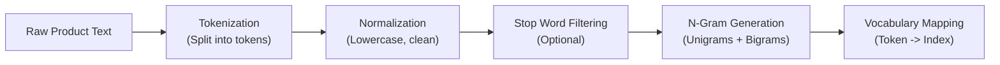
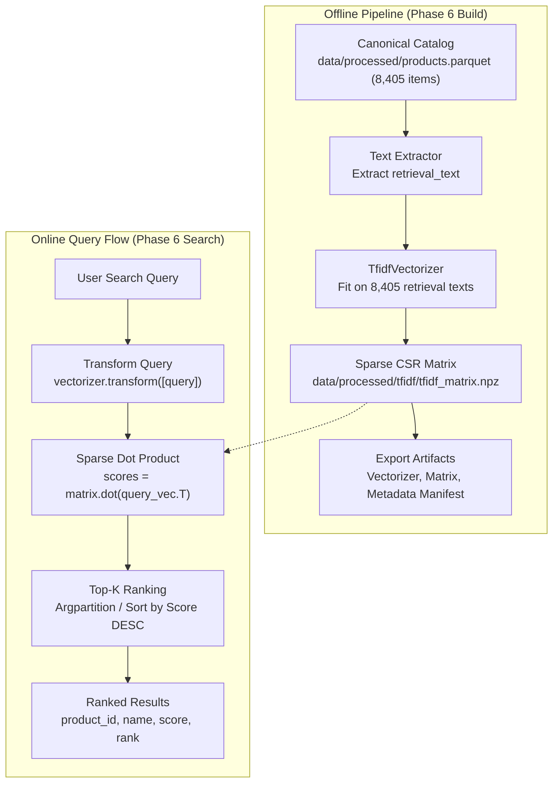

# TF-IDF Retrieval Fundamentals & Lexical Search Theory

## 1. Information Retrieval (IR) in Modern E-Commerce

### 1.1 What is Information Retrieval?
**Information Retrieval (IR)** is the computational discipline of locating, ranking, and returning relevant unstructured or semi-structured information items (such as documents, product descriptions, or web pages) from large collections in response to a user's informational need.

Unlike a relational database lookup where a query evaluates to a boolean predicate (e.g., `WHERE price <= 500`), information retrieval operates under **uncertainty**:
- The user's query is often ambiguous, brief, or colloquial.
- The document collection contains unstructured natural language.
- The goal is not merely finding matching records, but **ranking** candidates from most to least relevant.

### 1.2 Information Retrieval vs. Text Generation
In modern AI systems, it is essential to distinguish between **retrieval** and **generation**:

| Dimension | Information Retrieval (IR) | Text Generation (Generative AI / LLM) |
|---|---|---|
| **Core Objective** | Locate existing verified items from a corpus | Synthesize new text, sequences, or reasoning |
| **Output Space** | Discrete documents / product records with IDs | Freeform text token sequences |
| **Ground Truth** | Directly grounded in the catalog | Risk of hallucination without retrieval grounding |
| **Speed & Cost** | Sub-millisecond to low-millisecond, low cost | Hundreds of milliseconds, high GPU compute cost |
| **Role in ShopAssist** | Candidate generator (Retrieval Engine) | Query understander, conversational assistant, recommender |

In **ShopAssist**, Information Retrieval serves as the factual bedrock. Rather than asking a Large Language Model (LLM) to guess which products exist in Flipkart's inventory, the IR system efficiently retrieves candidate product records from our validated Product Knowledge Base, which the LLM then synthesizes into personalized conversational recommendations.

### 1.3 Key Concepts in ShopAssist Product Search
- **Document ($d$):** In ShopAssist, a document represents a single catalog product. Specifically, each document is the structured, standardized semantic text field constructed in Phase 5.2: `retrieval_text`. It incorporates the product title, primary category, canonical brand, key specifications, and truncated description.
- **Query ($q$):** A natural-language string entered by an online shopper representing their product intent (e.g., `"wireless bluetooth keyboard"`, `"comfortable walking shoes"`, or `"laptop under 500"`).
- **Ranking:** The algorithmic scoring and sorting of all documents in the corpus according to a similarity or relevance metric $S(q, d)$, placing the most relevant items first.
- **Top-$K$ Retrieval:** The process of returning only the top $K$ ranked items (e.g., $K=5$ or $K=10$) rather than presenting the entire catalog to the shopper or downstream LLM.
- **Retrieval Baseline:** A well-understood, deterministic reference model (such as TF-IDF) against which more sophisticated retrieval methods (such as dense vector embeddings in Phase 7 and hybrid search in Phase 10) are rigorously benchmarked to justify their added computational complexity.

---

## 2. Lexical Retrieval vs. Semantic Retrieval

A central theme in modern Search & Recommendation is the trade-off between **lexical** and **semantic** retrieval:

```
                            ┌───────────────────────────────────────────────┐
                            │            Information Retrieval              │
                            └───────────────────────┬───────────────────────┘
                                                    │
                        ┌───────────────────────────┴───────────────────────────┐
                        ▼                                                       ▼
        ┌───────────────────────────────┐                       ┌───────────────────────────────┐
        │       Lexical Retrieval       │                       │       Semantic Retrieval      │
        │      (e.g., TF-IDF, BM25)     │                       │     (e.g., BGE, Dense HNSW)   │
        ├───────────────────────────────┤                       ├───────────────────────────────┤
        │ • Surface token overlap       │                       │ • Continuous embedding space  │
        │ • Exact keyword matching      │                       │ • Concept & synonym matching  │
        │ • High precision on names     │                       │ • Overcomes vocabulary gap    │
        │ • Vocabulary mismatch flaw    │                       │ • Dense vector dot product    │
        └───────────────────────────────┘                       └───────────────────────────────┘
```

### 2.1 Lexical Retrieval (Vocabulary & Exact Keyword Overlap)
**Lexical retrieval** scores documents based on the presence, frequency, and statistical distinctiveness of identical or stemmed words shared between the query and the document.
- **Mechanism:** Document vectors are constructed over a high-dimensional vocabulary. Non-zero coordinates indicate surface term overlap.
- **Strength:** Unmatched precision for exact technical keywords, product codes, model identifiers (e.g., `"CM 1904"`, `"SE122102"`, `"HDMI"`, `"RTX 3050"`), and distinctive brand names (`"Allure Auto"`).
- **Fundamental Flaw:** **The Vocabulary Mismatch Problem**. If the user searches for `"sneakers"`, but the catalog exclusively uses `"running shoes"` or `"athletic footwear"`, a pure lexical retrieval engine assigns a similarity score of zero because there is zero token overlap.

### 2.2 Semantic Retrieval (Dense Continuous Vector Embeddings)
**Semantic retrieval** maps both queries and documents into a shared continuous embedding space (e.g., $\mathbb{R}^{384}$ using `BAAI/bge-small-en-v1.5`) where geometric proximity represents conceptual similarity rather than character overlap.
- **Mechanism:** Deep transformer encoders capture contextual relationships, semantic equivalence, and stylistic variations.
- **Strength:** Automatically bridges synonymy (recognizing that `"sneakers" \approx "running shoes"` or `"portable battery" \approx "power bank"`).
- **Weakness:** Can over-generalize on fine-grained model numbers, rare technical acronyms, or specific alphanumeric codes.

### 2.3 Why TF-IDF is Lexical Despite Being "Vectorized"
A common point of confusion for AI engineering learners is: *If TF-IDF converts text into vectors, why is it called lexical rather than semantic?*

The answer lies in what each vector dimension represents:
- In **TF-IDF**, each dimension corresponds strictly to a **specific discrete vocabulary word** (e.g., dimension 402 is `"keyboard"`, dimension 403 is `"keychain"`). Dimensions are orthogonal by definition; the model has no knowledge that `"shoe"` and `"sneaker"` are related. They are two distinct, independent axes.
- In **Dense Semantic Embeddings**, dimensions are **latent continuous representation features** learned by a neural network. Words with related meanings map to nearby regions in the geometric space.

Therefore, TF-IDF is a **pure lexical retrieval method** implemented via linear algebra.

---

## 3. Text Processing Fundamentals for Lexical Search

Before mathematical formulas can be evaluated, raw text must be transformed into discrete statistical units:



### 3.1 Key Terminology
- **Corpus ($\mathcal{C}$):** The entire collection of documents available for retrieval. In ShopAssist, $\mathcal{C}$ contains $N = 8,405$ validated product retrieval texts.
- **Document ($d$):** An individual text sequence in the corpus ($d \in \mathcal{C}$).
- **Token ($t$):** An atomic unit of text, usually a word or alphanumeric string produced by splitting and filtering.
- **Tokenization:** The algorithmic process of breaking continuous character strings into discrete tokens.
- **Vocabulary ($\mathcal{V}$):** The set of all unique recognized tokens across the corpus after filtering. Its size $|\mathcal{V}|$ defines the dimensionality of the TF-IDF feature space.
- **Stop Words:** High-frequency, low-information function words (such as *"the"*, *"and"*, *"in"*, *"of"*) that occur in almost every document.
- **N-Grams:** Contiguous sequences of $n$ tokens from a given text.
  - *Unigrams ($n=1$):* `["wireless", "bluetooth", "keyboard"]`
  - *Bigrams ($n=2$):* `["wireless bluetooth", "bluetooth keyboard"]`
  - Combining unigrams and bigrams allows lexical models to capture common compound phrases like `"running shoes"` and `"power bank"`.
- **Document Frequency ($\text{df}(t)$):** The number of documents in the corpus that contain term $t$:
  $$\text{df}(t) = |\{d \in \mathcal{C} : t \in d\}|$$
- **Term Frequency ($\text{TF}(t, d)$):** The number of times term $t$ appears within document $d$.
- **Out-of-Vocabulary (OOV) Term:** A query token that does not appear in the fitted training vocabulary $\mathcal{V}$. OOV tokens cannot be mapped to any matrix column and receive zero weight.

### 3.2 Scikit-Learn Tokenization Behavior in E-Commerce
In `sklearn.feature_extraction.text.TfidfVectorizer`, the default token pattern is:
```python
token_pattern = r"(?u)\b\w\w+\b"
```
This regular expression matches Unicode word characters (`\w`) having **two or more characters** (`\w\w+`), with word boundaries (`\b`).

**Crucial E-Commerce Implication:**
The default pattern drops all single-character tokens. In standard text, this conveniently filters out orphan punctuation and single letters. However, in an e-commerce catalog, it might drop meaningful single-letter tokens unless configured deliberately. In ShopAssist, product titles and specifications frequently contain alphanumeric terms like `"3D"`, `"4K"`, `"10"`, `"i5"`, or `"SE"`. Because these all have two or more characters, they are correctly preserved by `(?u)\b\w\w+\b`.

---

## 4. Mathematical Formulation of TF-IDF

**TF-IDF** stands for **Term Frequency – Inverse Document Frequency**. It is a composite numerical statistic that reflects how important a word is to a document within a given corpus.

The intuition is governed by two complementary rules:
1. **Rule 1 (TF):** If a term appears many times in a document, it is likely descriptive of that document's specific topic.
2. **Rule 2 (IDF):** If a term appears in almost *every* document across the catalog (e.g., `"product"`, `"features"`), it provides almost no discriminative power for distinguishing between products.

$$\text{TF-IDF}(t, d, \mathcal{C}) = \text{TF}(t, d) \times \text{IDF}(t, \mathcal{C})$$

---

## 5. Term Frequency ($\text{TF}$) Deep Dive

### 5.1 Raw Term Frequency
The simplest formulation of term frequency is the raw occurrence count of term $t$ in document $d$:
$$\text{TF}_{\text{raw}}(t, d) = f_{t, d}$$

### 5.2 Sublinear Term Frequency Scaling
In e-commerce descriptions, a vendor might repeat a keyword 20 times (e.g., *"running shoes, best running shoes, quality running shoes..."*). Does a product mentioning a word 20 times have 20 times the relevance of a product mentioning it once? **No.**

To prevent excessive term repetition from distorting retrieval relevance, modern IR utilizes **sublinear term frequency scaling** (enabled via `sublinear_tf=True` in scikit-learn):

$$\text{TF}_{\text{sublinear}}(t, d) = \begin{cases} 1 + \ln(f_{t, d}) & \text{if } f_{t, d} > 0 \\ 0 & \text{if } f_{t, d} = 0 \end{cases}$$

#### Comparative Example:
- If $f_{t, d} = 1$: $\text{TF}_{\text{sublinear}} = 1 + \ln(1) = 1.000$
- If $f_{t, d} = 5$: $\text{TF}_{\text{sublinear}} = 1 + \ln(5) \approx 1 + 1.609 = 2.609$
- If $f_{t, d} = 20$: $\text{TF}_{\text{sublinear}} = 1 + \ln(20) \approx 1 + 2.996 = 3.996$

While the raw count increased 20-fold, the logarithmic sublinear weight increased only 4-fold. This provides robust protection against keyword-stuffing.

---

## 6. Inverse Document Frequency ($\text{IDF}$) Deep Dive

### 6.1 The Intuition of Rare vs. Common Terms
Consider two words in the ShopAssist catalog:
1. The word `"the"` or `"product"`: occurs in virtually all 8,405 products.
2. The word `"carabiner"`: occurs in only 12 products in the Tools category.

If a shopper searches for `"heavy duty carabiner"`, the word `"carabiner"` carries far more informative weight than `"heavy"`. IDF mathematically discounts common words and boosts discriminative words.

### 6.2 Scikit-Learn's Smoothed IDF Formula
Scikit-learn implements a standard smoothed variant of inverse document frequency (`smooth_idf=True`):

$$\text{IDF}(t) = \ln\left(\frac{1 + N}{1 + \text{df}(t)}\right) + 1$$

Where:
- $N$: Total number of documents in the corpus ($|\mathcal{C}|$).
- $\text{df}(t)$: Document frequency of term $t$ (count of documents containing $t$).
- The $+1$ inside the logarithm is the **smoothing constant** (Laplace smoothing), preventing division by zero if $\text{df}(t) = 0$.
- The $+1$ outside the logarithm ensures that terms appearing in all documents ($\text{df}(t) = N$) receive a positive non-zero weight rather than being discarded entirely:
  $$\ln\left(\frac{1 + N}{1 + N}\right) + 1 = \ln(1) + 1 = 0 + 1 = 1.000$$

#### Numerical Walkthrough of IDF Values ($N = 8,405$):
| Term Type | Sample Term | Document Frequency $\text{df}(t)$ | Smooth IDF Calculation | Final $\text{IDF}(t)$ |
|---|---|---|---|---|
| **Ubiquitous** | `"product"` | $8,405$ (100% of catalog) | $\ln\left(\frac{8406}{8406}\right) + 1 = \ln(1) + 1$ | **1.000** |
| **Common** | `"black"` | $3,500$ (41.6% of catalog) | $\ln\left(\frac{8406}{3501}\right) + 1 = \ln(2.401) + 1$ | **1.876** |
| **Category-Specific** | `"automotive"` | $1,010$ (12.0% of catalog) | $\ln\left(\frac{8406}{1011}\right) + 1 = \ln(8.315) + 1$ | **3.118** |
| **Rare / Technical** | `"bluetooth"` | $320$ (3.8% of catalog) | $\ln\left(\frac{8406}{321}\right) + 1 = \ln(26.187) + 1$ | **4.265** |
| **Highly Specific** | `"carabiner"` | $12$ (0.14% of catalog) | $\ln\left(\frac{8406}{13}\right) + 1 = \ln(646.615) + 1$ | **7.472** |

As demonstrated, the specific term `"carabiner"` receives a weight **7.47x higher** than the generic term `"product"`.

---

## 7. Complete Worked Example: 3 Product Documents

To demonstrate exact mathematical consistency, let us trace a complete TF-IDF calculation from raw documents to normalized sparse vectors.

### 7.1 The Mini-Corpus ($N = 3$)
- **Document 1 ($d_1$):** `"running shoes running"`
- **Document 2 ($d_2$):** `"running shoes athletic"`
- **Document 3 ($d_3$):** `"leather watch digital"`

### 7.2 Step 1: Vocabulary & Document Frequencies
Alphabetical vocabulary ($|\mathcal{V}| = 6$ unique unigrams):
$$\mathcal{V} = \{\text{"athletic"}, \text{"digital"}, \text{"leather"}, \text{"running"}, \text{"shoes"}, \text{"watch"}\}$$

Document frequency $\text{df}(t)$ across the 3 documents:
- $\text{df}(\text{"athletic"}) = 1$ (present in $d_2$)
- $\text{df}(\text{"digital"}) = 1$ (present in $d_3$)
- $\text{df}(\text{"leather"}) = 1$ (present in $d_3$)
- $\text{df}(\text{"running"}) = 2$ (present in $d_1, d_2$)
- $\text{df}(\text{"shoes"}) = 2$ (present in $d_1, d_2$)
- $\text{df}(\text{"watch"}) = 1$ (present in $d_3$)

### 7.3 Step 2: Smoothed IDF Weights ($N = 3$)
$$\text{IDF}(t) = \ln\left(\frac{1 + 3}{1 + \text{df}(t)}\right) + 1 = \ln\left(\frac{4}{1 + \text{df}(t)}\right) + 1$$

- For terms with $\text{df} = 2$ (`"running"`, `"shoes"`):
  $$\text{IDF} = \ln\left(\frac{4}{3}\right) + 1 \approx 0.287682 + 1 = \mathbf{1.287682}$$
- For terms with $\text{df} = 1$ (`"athletic"`, `"digital"`, `"leather"`, `"watch"`):
  $$\text{IDF} = \ln\left(\frac{4}{2}\right) + 1 = \ln(2) + 1 \approx 0.693147 + 1 = \mathbf{1.693147}$$

### 7.4 Step 3: Raw Term Frequencies & Unnormalized TF-IDF
Term occurrence counts $f_{t, d}$:

| Vocabulary Term | $d_1$ Count | $d_2$ Count | $d_3$ Count | IDF Weight |
|---|---|---|---|---|
| `"athletic"` | 0 | 1 | 0 | 1.693147 |
| `"digital"` | 0 | 0 | 1 | 1.693147 |
| `"leather"` | 0 | 0 | 1 | 1.693147 |
| `"running"` | 2 | 1 | 0 | 1.287682 |
| `"shoes"` | 1 | 1 | 0 | 1.287682 |
| `"watch"` | 0 | 0 | 1 | 1.693147 |

Unnormalized $\text{TF-IDF} = \text{TF} \times \text{IDF}$:
- **For $d_1$:**
  - `"running"`: $2 \times 1.287682 = 2.575364$
  - `"shoes"`: $1 \times 1.287682 = 1.287682$
  - Unnormalized vector: $\mathbf{v}_1 = [0.000, 0.000, 0.000, 2.575364, 1.287682, 0.000]$
- **For $d_2$:**
  - `"athletic"`: $1 \times 1.693147 = 1.693147$
  - `"running"`: $1 \times 1.287682 = 1.287682$
  - `"shoes"`: $1 \times 1.287682 = 1.287682$
  - Unnormalized vector: $\mathbf{v}_2 = [1.693147, 0.000, 0.000, 1.287682, 1.287682, 0.000]$
- **For $d_3$:**
  - `"digital"`: $1 \times 1.693147 = 1.693147$
  - `"leather"`: $1 \times 1.693147 = 1.693147$
  - `"watch"`: $1 \times 1.693147 = 1.693147$
  - Unnormalized vector: $\mathbf{v}_3 = [0.000, 1.693147, 1.693147, 0.000, 0.000, 1.693147]$

### 7.5 Step 4: L2 Vector Normalization
To ensure fair comparison regardless of document length, each vector is divided by its Euclidean norm ($L_2$ norm):
$$\|\mathbf{v}\|_2 = \sqrt{\sum_{i=1}^{|\mathcal{V}|} v_i^2}, \quad \hat{\mathbf{v}} = \frac{\mathbf{v}}{\|\mathbf{v}\|_2}$$

- **Norm of $d_1$:**
  $$\|\mathbf{v}_1\|_2 = \sqrt{2.575364^2 + 1.287682^2} = \sqrt{6.63250 + 1.65812} = \sqrt{8.29062} \approx 2.879344$$
  Normalized vector $\hat{\mathbf{v}}_1$:
  - `"running"`: $2.575364 / 2.879344 = \mathbf{0.894427}$
  - `"shoes"`: $1.287682 / 2.879344 = \mathbf{0.447214}$
  $$\hat{\mathbf{v}}_1 = [0.000000, 0.000000, 0.000000, 0.894427, 0.447214, 0.000000]$$

- **Norm of $d_2$:**
  $$\|\mathbf{v}_2\|_2 = \sqrt{1.693147^2 + 1.287682^2 + 1.287682^2} = \sqrt{2.86675 + 1.65812 + 1.65812} = \sqrt{6.18300} \approx 2.486563$$
  Normalized vector $\hat{\mathbf{v}}_2$:
  - `"athletic"`: $1.693147 / 2.486563 = \mathbf{0.680919}$
  - `"running"`: $1.287682 / 2.486563 = \mathbf{0.517856}$
  - `"shoes"`: $1.287682 / 2.486563 = \mathbf{0.517856}$
  $$\hat{\mathbf{v}}_2 = [0.680919, 0.000000, 0.000000, 0.517856, 0.517856, 0.000000]$$

- **Norm of $d_3$:**
  $$\|\mathbf{v}_3\|_2 = \sqrt{3 \times 1.693147^2} = 1.693147 \times \sqrt{3} \approx 2.932616$$
  Normalized vector $\hat{\mathbf{v}}_3$:
  - Each non-zero term is $1 / \sqrt{3} \approx \mathbf{0.577350}$
  $$\hat{\mathbf{v}}_3 = [0.000000, 0.577350, 0.577350, 0.000000, 0.000000, 0.577350]$$

---

## 8. Cosine Similarity & Fast Retrieval Mathematics

### 8.1 Definition of Cosine Similarity
Cosine similarity evaluates the cosine of the angle between two multi-dimensional vectors:
$$\text{cosine}(\mathbf{q}, \mathbf{d}) = \frac{\mathbf{q} \cdot \mathbf{d}}{\|\mathbf{q}\|_2 \|\mathbf{d}\|_2} = \frac{\sum_{i=1}^{|\mathcal{V}|} q_i d_i}{\sqrt{\sum_{i=1}^{|\mathcal{V}|} q_i^2} \sqrt{\sum_{i=1}^{|\mathcal{V}|} d_i^2}}$$

### 8.2 Equivalence to Dot Product for L2-Normalized Vectors
Because all document vectors in the matrix $\mathbf{X}$ and query vectors $\mathbf{q}$ are pre-normalized to unit Euclidean length ($\|\hat{\mathbf{d}}\|_2 = 1$ and $\|\hat{\mathbf{q}}\|_2 = 1$):
$$\text{cosine}(\hat{\mathbf{q}}, \hat{\mathbf{d}}) = \frac{\hat{\mathbf{q}} \cdot \hat{\mathbf{d}}}{1 \times 1} = \hat{\mathbf{q}} \cdot \hat{\mathbf{d}} = \sum_{i=1}^{|\mathcal{V}|} \hat{q}_i \hat{d}_i$$

This algebraic property is what allows modern search engines to perform cosine similarity ranking with extreme speed: **retrieval reduces to a single sparse matrix-vector dot product**:
$$\mathbf{s} = \mathbf{X} \cdot \hat{\mathbf{q}}^\top$$
Where $\mathbf{s} \in \mathbb{R}^{N}$ is the vector of similarity scores across all $N$ products.

### 8.3 Query Scoring Walkthrough
Suppose a user submits the query:
$$q = \text{"running shoes"}$$

1. Vectorizing $q$: Term frequencies are $f_{\text{"running"}} = 1, f_{\text{"shoes"}} = 1$.
   Unnormalized query vector:
   $$\mathbf{q} = [0, 0, 0, 1.287682, 1.287682, 0]$$
2. Normalizing $q$:
   $$\|\mathbf{q}\|_2 = \sqrt{1.287682^2 + 1.287682^2} = 1.287682 \times \sqrt{2} \approx 1.821057$$
   $$\hat{\mathbf{q}} = [0.000, 0.000, 0.000, 0.707107, 0.707107, 0.000]$$
3. Computing Cosine Similarities against our 3 documents:
   - **Score for $d_1$ (`"running shoes running"`):**
     $$\hat{\mathbf{q}} \cdot \hat{\mathbf{v}}_1 = (0.707107 \times 0.894427) + (0.707107 \times 0.447214) = 0.632456 + 0.316228 = \mathbf{0.948684}$$
   - **Score for $d_2$ (`"running shoes athletic"`):**
     $$\hat{\mathbf{q}} \cdot \hat{\mathbf{v}}_2 = (0.707107 \times 0.517856) + (0.707107 \times 0.517856) = 0.366180 + 0.366180 = \mathbf{0.732360}$$
   - **Score for $d_3$ (`"leather watch digital"`):**
     $$\hat{\mathbf{q}} \cdot \hat{\mathbf{v}}_3 = 0.000000$$

4. **Final Ranked Results:**
   - **Rank 1:** Document 1 (Score: **0.9487**)
   - **Rank 2:** Document 2 (Score: **0.7324**)
   - **Rank 3:** Document 3 (Score: **0.0000** - filtered out by positive-score policy)

Notice how Document 1 ranks higher than Document 2 because it has a higher concentration of the query term `"running"`, whereas Document 2 dilutes its length norm with the extraneous term `"athletic"`.

---

## 9. Sparse Matrix Representations & SciPy CSR

### 9.1 Why Sparse Representation is Mandatory
In ShopAssist's catalog:
- Total products ($N$): **8,405**
- Vocabulary size ($|\mathcal{V}|$): **~60,000** (unigrams + bigrams)
- Total potential matrix cells: $8,405 \times 60,000 = \mathbf{504,300,000\text{ cells}}$

If stored as a dense 64-bit float matrix:
$$\text{Memory} = 504.3 \times 10^6 \times 8\text{ bytes} \approx \mathbf{4.03\text{ Gigabytes}}$$

However, an average product description contains only ~145 unique terms. More than **99.7% of all cells in the matrix are zeros!** Storing 500 million zeros is immensely wasteful.

### 9.2 The Compressed Sparse Row (CSR) Format
SciPy's `csr_matrix` stores only the non-zero values using three 1D arrays:
1. `data`: Array of all non-zero floating-point values (length $\text{nnz} \approx 1,220,000$).
2. `indices`: Array of column indices (vocabulary IDs) corresponding to each entry in `data`.
3. `indptr`: Array of pointers indicating where each document's row starts and ends in `data` (length $N + 1 = 8,406$).

#### Actual ShopAssist Storage Comparison:
| Format | Non-Zero Count | Memory Footprint | Sparsity |
|---|---|---|---|
| **Dense Array (`np.ndarray`)** | 504,300,000 | **~4,034 MB** | 0.0% |
| **Sparse Matrix (`csr_matrix`)** | 1,219,908 | **~14.6 MB** | **99.76%** |

The sparse representation reduces memory consumption by **over 99.6%**, allowing the entire index to reside permanently in RAM for instant sub-millisecond retrieval.

---

## 10. Fundamental Limitations of TF-IDF in E-Commerce

While TF-IDF provides an indispensable baseline, it suffers from several inherent constraints that necessitate subsequent phases in the ShopAssist architecture:

### 10.1 The Vocabulary Mismatch (Synonym) Problem
- **Query:** `"athletic footwear for jogging"`
- **Catalog Item:** `"Campus Running Shoes"`
- **Outcome:** If `"jogging"` and `"footwear"` do not appear in the title or specifications, the match score is penalized or zero, even though the product is an exact match for the user's need.
- *Mitigation:* Phase 7 introduces dense semantic vector search with `BAAI/bge-small-en-v1.5`.

### 10.2 Polysemy & Ambiguity
- Words have multiple meanings depending on context.
- The word `"apple"` could refer to fresh fruit, Apple Inc. electronics, or apple-flavored vape liquid. TF-IDF treats all occurrences identically.

### 10.3 Absence of Syntactic & Word Order Awareness
- Pure bag-of-words ignores grammar: `"blue dress with red belt"` scores identically to `"red dress with blue belt"`.
- *Partial mitigation:* Bigrams partially capture order, but full attention mechanisms (Transformers) are required for complex relational queries.

### 10.4 Inability to Enforce Numerical & Structured Constraints
- **Query:** `"laptop under 500"`
- **TF-IDF Behavior:** The number `"500"` is treated as a plain lexical token. Products matching model `"HP 500"`, `"Fiat 500"`, or `"500 ml"` will rank high, while an actual $350 laptop with a different model number will receive no credit for being "under 500".
- *Mitigation:* Phase 5 provisions relational B-Tree indexes in Supabase PostgreSQL; Phase 8 implements LLM Query Understanding to separate structured filters (`WHERE discounted_price <= 500`) from semantic keywords.

---

## 11. Role of Phase 6 in the ShopAssist Architecture

In the overall ShopAssist roadmap, Phase 6 establishes **Baseline 1**:



### Architectural Purpose
1. **Performance Benchmark:** Establishes the computational latency baseline (sub-5 ms) that more complex neural models must justify.
2. **Lexical Retrieval Anchor:** In Phase 10 (Hybrid Retrieval), this TF-IDF pipeline (or its BM25 extension) will be combined with dense HNSW vector search using **Reciprocal Rank Fusion (RRF)** to deliver the best of both worlds: exact keyword precision and broad semantic recall.
