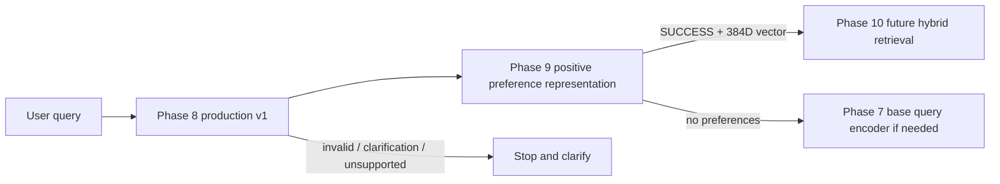

# ShopAssist Development Status and Checklist

**Updated:** 2026-10-10. This is the current roadmap status; prior phase reports remain historical evidence.

| Phase | Current status | Evidence / next gate |
| --- | --- | --- |
| 1–7 | Implemented | Existing phase reports and artifacts; embeddings/model assets retained. |
| 8 | **IMPLEMENTED — ACCEPTED WITH KNOWN LIMITATIONS** | Production remains Gemini `gemini-3.1-flash-lite`, temperature `0.0`, Schema v1. Freeze manifest and debt register created. |
| 8.1 | **EXPERIMENTAL REFINEMENT COMPLETE — NOT FULLY ADOPTED IN PRODUCTION** | E5-B/schema-v2 remain experimental; historical reports preserved. |
| 8.2 | **PARTIAL — RESEARCH AND OFFLINE VALIDATION COMPLETE; LIVE OPTIMIZATION DEFERRED** | 12 investigations reconciled; no deferred 312-call run. |
| 9 | **PASS — COMPONENT SCOPE** | 22/22 Phase 9 tests; 398/398 offline regression tests (Gemini module excluded); 384D BGE validation; 12/12 curated relevant-over-irrelevant paired checks; local CUDA timings. Not an end-to-end recommendation-quality claim. |
| 10 | Not started | Hybrid retrieval only after Phase 9 runtime readiness; validate hard constraints and unsupported intent separately. |
| 11–17 | Not started | Reranking, recommendation, evaluation, API, Telegram and deployment follow roadmap. |

## Current Phase 9 checklist

- [x] Deterministic normalization and stable query composition implemented.
- [x] Typed output statuses and no-preference behavior implemented.
- [x] Phase 8 v1 integration boundary and clarification/error handling implemented.
- [x] Conservative exclusion/currency guard implemented.
- [x] Phase 7 BGE encoder adapter implemented with 384D/finite/unit-norm checks and batch adapter.
- [x] Offline unit and mocked integration tests authored.
- [x] Phase 8 freeze manifest and reconciled technical debt documented.
- [x] Execute Phase 9 tests in the project dependency environment (22/22).
- [x] Execute real BGE model and vector compatibility checks (384D finite normalized outputs).
- [x] Measure paired composition ranking and single/batch performance (four curated cases).
- [x] Run applicable Phase 5–8 offline regression suite (398 passed; Gemini module excluded).
- [ ] Coalesce safe `represent_batch` requests into one embedding batch.

## Current flow

See [Phase 8 freeze and handover](phase8_freeze_and_handover.md), [Phase 8 technical debt](technical_debt/phase8_deferred_issues.md), and [Phase 9 engineering report](phase9_soft_preference_representation.md).
