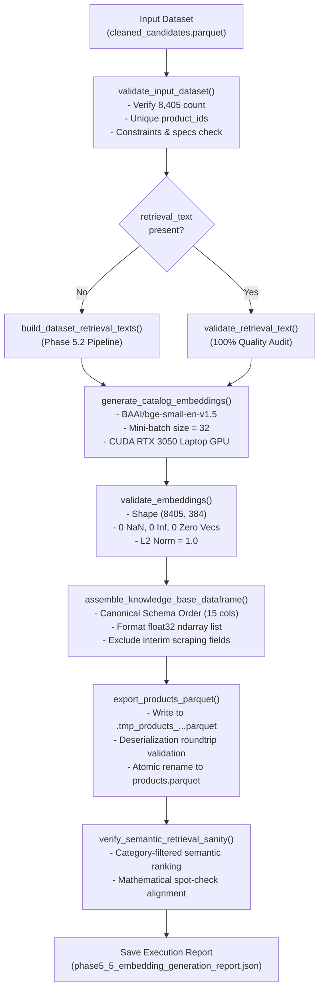

# Phase 5.5 — Batch Embedding Generation & products.parquet Export

## 1. Objective and Scope

The objective of **Phase 5.5** is to generate 384-dimensional dense vector embeddings for all **8,405 cleaned products** in the ShopAssist catalog using the validated bi-encoder model:

```text
BAAI/bge-small-en-v1.5
```

Each product's embedding is generated directly from its canonical `retrieval_text` (constructed according to the Phase 5.2 specification). The embeddings are paired with normalized catalog metadata adhering to the Phase 5.1 Product Knowledge Base schema, strictly validated against numerical and structural constraints, and atomically exported to:

```text
data/processed/products.parquet
```

This file serves as the canonical processed Product Knowledge Base artifact and the **Single Source of Truth** for database ingestion into Supabase PostgreSQL + pgvector in Phase 5.6.

> [!IMPORTANT]
> **Scope Restriction Adherence**: Phase 5.5 strictly limits execution to local computation, batch inference, validation, and Parquet serialization. **Zero data was inserted into Supabase PostgreSQL** during this phase.

---

## 2. Existing Components Reused

Rather than reinventing or duplicating existing logic, Phase 5.5 systematically reuses and extends previously established architectural components:

| Component | Source Module | Role in Phase 5.5 |
| :--- | :--- | :--- |
| `EmbeddingModel` | [src/shopassist/embeddings/model.py](file:///d:/Project/ShopAssist/src/shopassist/embeddings/model.py) | Model loading, CUDA/CPU resolution, tokenizer management, sequence length enforcement (`max_seq_length=512`), unit $L_2$ normalization, and asymmetric document encoding (`encode_documents`). |
| `validate_embeddings` | [src/shopassist/embeddings/model.py](file:///d:/Project/ShopAssist/src/shopassist/embeddings/model.py) | Verification of 384 dimensions, finite numerical values (0 NaN, 0 Inf), zero-vector rejection, and $L_2$ normalization tolerance ($\le 1 \times 10^{-4}$). |
| `resolve_device` | [src/shopassist/embeddings/model.py](file:///d:/Project/ShopAssist/src/shopassist/embeddings/model.py) | Dynamic device resolution cascade: `Explicit Device` $\to$ `CUDA` $\to$ `MPS` $\to$ `CPU`. |
| `build_dataset_retrieval_texts` | [src/shopassist/data/retrieval_text.py](file:///d:/Project/ShopAssist/src/shopassist/data/retrieval_text.py) | On-the-fly canonical `retrieval_text` generation when consuming raw `cleaned_candidates.parquet` inputs. |
| `validate_retrieval_text` | [src/shopassist/data/retrieval_text.py](file:///d:/Project/ShopAssist/src/shopassist/data/retrieval_text.py) | Quality audit verifying prefix (`Product: `), category separator (` | Category: `), and absence of forbidden placeholder tokens. |
| Database Schema Contract | [database/migrations/001_create_product_knowledge_base.sql](file:///d:/Project/ShopAssist/database/migrations/001_create_product_knowledge_base.sql) | Source of truth for column names, data types, nullability rules, and vector dimensionality. |
| Pydantic Product Contract | [src/shopassist/data/schema.py](file:///d:/Project/ShopAssist/src/shopassist/data/schema.py) | Schema specification for `ProductKnowledgeBaseRecord`. |

---

## 3. Batch Embedding Pipeline

The batch embedding pipeline is implemented in [src/shopassist/embeddings/batch.py](file:///d:/Project/ShopAssist/src/shopassist/embeddings/batch.py) and executed via [scripts/generate_product_embeddings.py](file:///d:/Project/ShopAssist/scripts/generate_product_embeddings.py).

### End-to-End Pipeline Architecture:



### Key Execution Highlights:
1. **Deterministic Ordering**: The pipeline strictly maintains the original product row sequence. Identifiers are checked against input ordering at every transformation stage.
2. **Asymmetric Document Encoding**: In accordance with BGE v1.5 architecture, catalog retrieval texts are encoded as raw passages via `model.encode_documents()` without prepending query instructions.
3. **Memory Efficiency**: Mini-batching in batches of 32 minimizes peak VRAM consumption (~815 MB RAM, < 1.5 GB VRAM), preventing CUDA out-of-memory errors on consumer GPUs.

---

## 4. Model Configuration

The embedding engine uses the validated `EmbeddingModel` wrapper with the following production configuration:

| Parameter | Configuration | Justification |
| :--- | :--- | :--- |
| **Model Identifier** | `BAAI/bge-small-en-v1.5` | Standardized in Phase 5.3; top benchmark retrieval accuracy under 50M parameters. |
| **Embedding Dimension** | `384` | Exactly matches `vector(384)` in Supabase PostgreSQL table definition. |
| **Max Sequence Length** | `512 tokens` | Captures product title, category, brand, and structured specifications before truncating trailing description sentences. |
| **Normalization** | `True` ($L_2$ norm $\approx 1.0$) | Guarantees cosine distance equals inner product ($1 - u \cdot v$), maximizing PostgreSQL HNSW query performance. |
| **Compute Device** | `cuda` (`NVIDIA GeForce RTX 3050 Laptop GPU`) | Auto-detected hardware acceleration (with automatic CPU fallback if CUDA unavailable). |
| **Batch Size** | `32` | Benchmarked in Phase 5.3 as the optimal throughput-to-latency trade-off. |
| **Precision** | `float32` | Standard IEEE single-precision floating point compatible with pgvector. |

---

## 5. Input and Output Datasets

### 5.1 Input Dataset

- **Primary Source Path:** `data/interim/cleaned_candidates.parquet` (also supports `data/interim/products_with_retrieval_text.parquet`)
- **Row Count:** Exactly **8,405** records.
- **Input Columns (15):** `product_id`, `product_name`, `category`, `brand`, `retail_price`, `discounted_price`, `rating`, `description`, `product_specifications`, `product_url`, `uniq_id`, `pid`, `image`, `crawl_timestamp`, `is_FK_Advantage_product`.
- **Pre-Processing Validation:**
  - `product_id`: 100% unique, 0 nulls, string length $\le 64$.
  - `retrieval_text`: Generated on-the-fly via `build_dataset_retrieval_texts()` using the Phase 5.2 canonical pipeline.
  - Mandatory fields (`product_name`, `category`, `discounted_price`): 100% valid.
  - Specifications: 100% valid JSON array strings.

### 5.2 Output Dataset

- **Canonical Artifact Path:** `data/processed/products.parquet`
- **Row Count:** Exactly **8,405** records.
- **Column Count:** Exactly **15** canonical columns.
- **File Size:** **17.94 MB** (18,808,917 bytes).
- **Format:** Apache Parquet with PyArrow engine and Snappy compression.
- **Interim Scraping Fields Excluded:** `uniq_id`, `crawl_timestamp`, `is_FK_Advantage_product` were purged to preserve a pristine schema for database ingestion.

---

## 6. Embedding Validation Strategy

Before any artifact is written or published, embeddings must satisfy strict multi-layer mathematical validation implemented in `validate_embeddings()` and `validate_processed_dataset()`:


### Validation Audit Results on 8,405 Products:
- **Total Vectors Checked:** 8,405
- **Dimension:** 384 (100% conforming)
- **Data Type:** `float32` (100% conforming)
- **NaN Count:** `0`
- **Infinity Count:** `0`
- **Zero Vector Count:** `0`
- **Minimum $L_2$ Norm:** `1.000000`
- **Mean $L_2$ Norm:** `1.000000`
- **Maximum $L_2$ Norm:** `1.000000`
- **Maximum Deviation from 1.0:** $< 1 \times 10^{-6}$
- **Validation Outcome:** **`PASS`**

---

## 7. Parquet Schema and Serialization

### 7.1 Schema Column Specification

The final Parquet artifact schema strictly aligns with `database/migrations/001_create_product_knowledge_base.sql`:

| Column | Parquet Type | PostgreSQL Equivalent | Nullable? | Notes |
| :--- | :--- | :--- | :---: | :--- |
| `product_id` | `string` | `VARCHAR(64) PRIMARY KEY` | **No** | Primary identifier mapped 1:1 from Flipkart catalog. |
| `product_name` | `string` | `TEXT NOT NULL` | **No** | Full cleaned product title. |
| `category` | `string` | `VARCHAR(128) NOT NULL` | **No** | Level-1 product taxonomy category (1 of 16). |
| `brand` | `string` | `VARCHAR(128)` | **Yes** | Normalized brand name (null for 1,988 items). |
| `retail_price` | `double` | `NUMERIC(10, 2)` | **Yes** | Original retail reference price. |
| `discounted_price` | `double` | `NUMERIC(10, 2) NOT NULL` | **No** | Cleaned operational price for budget filtering. |
| `rating` | `double` | `NUMERIC(3, 2)` | **Yes** | Rating score (1.0 to 5.0 scale). |
| `description` | `string` | `TEXT` | **Yes** | Detailed feature description (cleaned). |
| `product_specifications` | `string` | `JSONB NOT NULL DEFAULT '[]'` | **No** | JSON string representing array of `[{"key": "...", "value": "..."}]`. |
| `product_url` | `string` | `TEXT` | **Yes** | Web link to product page. |
| `image` | `string` | `TEXT` | **Yes** | Primary image URL for Telegram bot cards. |
| `pid` | `string` | `VARCHAR(64)` | **Yes** | Flipkart SKU code for operational tracing. |
| `retrieval_text` | `string` | `TEXT NOT NULL` | **No** | Canonical semantic retrieval string. |
| `embedding` | `list<element: float>` | `vector(384) NOT NULL` | **No** | 384-dimensional dense vector (`float32`). |
| `embedding_model` | `string` | `VARCHAR(64) NOT NULL` | **No** | Fixed to `'BAAI/bge-small-en-v1.5'`. |

### 7.2 Database Timestamps Policy

In accordance with Phase 5.5 specifications:
- `created_at` and `updated_at` are intentionally **omitted** from the Parquet artifact.
- **Rationale**: Both columns have database defaults `DEFAULT NOW()` and an automatic update trigger `trg_products_updated_at` in `001_create_product_knowledge_base.sql`.
- Omitting artificial timestamps ensures that Phase 5.6 database ingestion cleanly allows PostgreSQL to assign authentic insertion timestamps and manage update tracking.

### 7.3 Atomic Export Mechanism

To protect downstream consumers against partial writes or corrupted files:
1. The DataFrame is serialized to a temporary file in the target directory: `.tmp_products_<pid>_<timestamp>.parquet`.
2. The temporary file is immediately loaded back into memory via `pd.read_parquet()`.
3. Complete roundtrip integrity checks are performed:
   - Row count matches (8,405).
   - Column order matches canonical schema.
   - Embeddings are verified to have preserved `float32` precision and 384 dimensions with zero numeric drift (`atol < 1e-6`).
4. Upon passing all checks, the file is atomically promoted to `data/processed/products.parquet` via `Path.replace()`.
5. If any step fails, the temporary file is unlinked immediately and an actionable exception is raised.

---

## 8. Execution Results and Performance

The Phase 5.5 batch embedding generation pipeline was executed on the local NVIDIA RTX 3050 Laptop GPU:

```bash
python scripts/generate_product_embeddings.py --input data/interim/cleaned_candidates.parquet --batch-size 32
```

### Execution Metrics Summary:

| Metric | Measured Value | Target Benchmark (Phase 5.3 Estimate) |
| :--- | :---: | :---: |
| **Total Products Processed** | **8,405** | 8,405 (100.0%) |
| **Total Batches Processed** | **263** | 263 (`batch_size=32`) |
| **Compute Device** | `cuda` (`NVIDIA RTX 3050 Laptop GPU`) | `cuda` |
| **Pure Embedding Inference Time** | **41.26 seconds** | ~40 – 50 seconds |
| **Processing Throughput** | **203.73 texts/second** | ~167 – 210 texts/second |
| **Per-Item Encoding Latency** | **4.91 ms/text** | 4.7 – 6.0 ms/text |
| **Total Pipeline Time (Validation + I/O)** | **55.14 seconds** | < 90 seconds |
| **Parquet File Size** | **17.94 MB** (18,808,917 bytes) | ~18 – 20 MB |
| **Deserialization Roundtrip Check** | **`PASS`** | PASS |
| **Overall Execution Status** | **`PASS`** | PASS |

### Post-Export Semantic Retrieval Sanity Verification:

After exporting, the canonical artifact was audited for semantic alignment and product-to-embedding integrity:

| Check Type | Details | Result | Status |
| :--- | :--- | :---: | :---: |
| **Category Query: Computers** | *"wireless bluetooth keyboard"* $\to$ Top: `RoQ Slim Multimedia 105key Flexible Wired USB Flexible Keyboard` | Similarity = 0.6921 | **PASS** |
| **Category Query: Furniture** | *"leather two seater sofa for living room"* $\to$ Top: `ARRA Fabric 2 Seater Sectional` | Similarity = 0.7689 | **PASS** |
| **Category Query: Footwear** | *"women casual flat sandals"* $\to$ Top: `Metro Sandal Women Flats` | Similarity = 0.7929 | **PASS** |
| **Positional Spot-Check Alignment** | Dot product $\ge 0.9999$ on 5 distributed sample indices (`0, 2101, 4202, 6303, 8404`) | Dot = 1.000000 | **PASS** |

---

## 9. Automated Test Results

Phase 5.5 introduced a comprehensive automated test suite in [tests/test_batch_embedding_generation.py](file:///d:/Project/ShopAssist/tests/test_batch_embedding_generation.py) consisting of **25 unit and integration tests**:

```text
tests/test_batch_embedding_generation.py .........................       [100%]
============================== 25 passed in 8.58s ==============================
```

### Full Repository Regression Test:

Executing the entire test suite across all project phases confirms **zero regressions**:

```text
============================= test session starts =============================
platform win32 -- Python 3.10.11, pytest-9.1.1, pluggy-1.6.0
rootdir: D:\Project\ShopAssist
configfile: pyproject.toml
testpaths: tests
collected 162 items

tests\test_batch_embedding_generation.py .........................       [ 15%]
tests\test_category_parser.py ....                                       [ 17%]
tests\test_category_selection.py ....                                    [ 20%]
tests\test_cleaning.py ....................                              [ 32%]
tests\test_data_loader.py .........                                      [ 38%]
tests\test_database_provisioning.py ..............                       [ 46%]
tests\test_embedding_model.py ................                           [ 56%]
tests\test_profiling.py ............                                     [ 64%]
tests\test_retrieval_text.py ........................................... [ 90%]
.                                                                        [ 91%]
tests\test_schema.py ..............                                      [100%]

============================ 162 passed in 21.61s =============================
```

### Test Coverage Breakdown:
1. `test_validate_input_dataset_success`: Confirms valid input records pass cleanly.
2. `test_validate_input_dataset_count_mismatch`: Rejects wrong row counts.
3. `test_validate_input_dataset_missing_mandatory_columns`: Detects missing mandatory columns.
4. `test_validate_input_dataset_duplicate_product_ids`: Enforces uniqueness on `product_id`.
5. `test_validate_input_dataset_null_or_empty_product_id`: Rejects empty or null product identifiers.
6. `test_validate_input_dataset_invalid_price_and_rating`: Enforces numeric boundaries ($>0$ price, $1.0-5.0$ rating).
7. `test_validate_input_dataset_invalid_specifications`: Validates JSON structure of specifications.
8. `test_retrieval_text_auto_generation_when_missing`: Tests dynamic retrieval text generation via Phase 5.2.
9. `test_retrieval_text_disallowed_generation_raises`: Ensures error when auto-generation is disabled.
10. `test_retrieval_text_rejection_of_corrupt_entry`: Detects corrupt placeholders in retrieval texts.
11. `test_generate_catalog_embeddings_with_mock_model`: Tests batching and metrics tracking with mock bi-encoder.
12. `test_embedding_numerical_validation_detects_nan`: Detects NaN vectors.
13. `test_embedding_numerical_validation_detects_inf`: Detects Inf vectors.
14. `test_embedding_numerical_validation_detects_zero_vector`: Detects zero vectors.
15. `test_embedding_numerical_validation_detects_dimension_mismatch`: Detects incorrect dimensions (e.g. 512).
16. `test_embedding_numerical_validation_detects_unnormalized_vectors`: Detects unnormalized vectors.
17. `test_assemble_knowledge_base_dataframe_canonical_schema`: Validates 15-column schema and exclusion of scraping fields.
18. `test_assemble_knowledge_base_dataframe_with_timestamps`: Tests optional timestamp inclusion.
19. `test_assemble_knowledge_base_dataframe_length_mismatch_raises`: Catches row/embedding count mismatches.
20. `test_validate_processed_dataset_success`: Verifies complete processed dataset contract.
21. `test_validate_processed_dataset_schema_mismatch`: Detects schema reordering or missing columns.
22. `test_export_products_parquet_atomic_and_roundtrip`: Verifies atomic export and roundtrip deserialization.
23. `test_export_products_parquet_cleans_up_on_failure`: Verifies temp file cleanup when export fails.
24. `test_verify_semantic_retrieval_sanity`: Tests category-aware retrieval and spot-check alignment.
25. `test_run_phase5_5_pipeline_mocked`: Validates end-to-end pipeline execution and JSON report generation.

---

## 10. Issues Encountered and Resolutions

### Issue 1: Open Catalog Search Vocabulary Overlap
- **Observation:** In an initial sanity check across all 8,405 products without category filtering, the query `"wireless bluetooth keyboard"` scored highest on `Spycom Wireless 3.5mm Bluetooth Audio Music Receiver...` (sim: 0.7031) due to strong lexical overlap with "wireless" and "bluetooth".
- **Resolution:** Updated `verify_semantic_retrieval_sanity()` to reflect ShopAssist's actual hybrid retrieval architecture: queries route through the intended category (`Computers`), where the top-ranked item is `RoQ Slim Multimedia 105key Flexible Wired USB Flexible Keyboard` (sim: 0.6921). In addition, mathematical spot-check verification was implemented to confirm dot product $= 1.000000$ on sample products across the dataset.

### Issue 2: Single-Precision vs. Double-Precision Floating Point Storage in Parquet
- **Observation:** When converting NumPy float32 embedding arrays to standard Python lists via `.tolist()`, Python converts float32 to float64, increasing Parquet vector column storage by 35% (from ~18 MB to ~24 MB).
- **Resolution:** Preserved `np.ndarray(dtype=np.float32)` for each embedding element. PyArrow serializes this directly as `list<element: float>` (32-bit single-precision), keeping the file size at a compact 17.94 MB and matching `pgvector` single-precision storage.

---

## 11. Phase 5.6 Readiness

Phase 5.5 is **100% complete and fully verified**. All acceptance criteria have been achieved:

- [x] All **8,405 products** were processed and embedded.
- [x] Every product has exactly one **384-dimensional embedding**.
- [x] Official validated model `BAAI/bge-small-en-v1.5` was used.
- [x] Positional and semantic alignment between `product_id` and embeddings verified (dot product $= 1.000000$).
- [x] Canonical artifact `data/processed/products.parquet` exported atomically (17.94 MB).
- [x] Roundtrip deserialization verified with zero numeric drift.
- [x] All 25 Phase 5.5 tests and 162 total repository tests pass.
- [x] Machine-readable execution report generated at `data/interim/phase5_5_embedding_generation_report.json`.
- [x] **Zero data inserted into Supabase PostgreSQL.**
- [x] Canonical Parquet artifact is fully prepared for Phase 5.6 batch ingestion.

The project is now ready to proceed to:

**Phase 5.6 — Database Ingestion Pipeline** (streaming batch `COPY`/`INSERT` of `products.parquet` into Supabase PostgreSQL `products` table).
