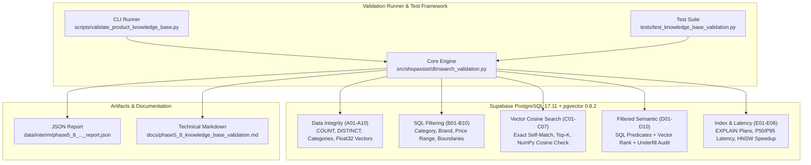

# Phase 5.8: Product Knowledge Base Validation & Filtered Search Verification

## 1. Executive Summary

Phase 5.8 is the final verification and quality assurance phase of **Product Knowledge Base Construction (Phase 5)** for **ShopAssist**.

The primary objective of Phase 5.8 is to prove through automated tests, reproducible read-only experiments, and rigorous performance benchmarking that the Product Knowledge Base:
1. **Preserves Catalog Integrity:** Correctly retains all 8,405 approved cleaned products across 16 categories with zero duplicates, zero missing mandatory fields, and zero data corruption.
2. **Executes Exact SQL Filtering:** Achieves a 100.0% Constraint Satisfaction Rate across single, range, boundary, and multi-attribute relational constraints without budget violations or errors.
3. **Executes Cosine Similarity Search:** Correctly calculates 384-dimensional cosine distance (`<=>`), achieving near-zero self-match distance ($0.00000000$), strict monotonic distance ordering, and float32 equivalence to independent NumPy ground truth (max numerical difference $< 10^{-4}$).
4. **Executes Filtered Semantic Search:** Seamlessly combines relational SQL predicates (category, brand, price ceiling) with vector similarity ranking, achieving 100.0% constraint satisfaction on retrieved top candidates.
5. **Retains Approved Indexes:** Confirms all 4 relational B-Tree indexes and 1 HNSW vector index remain valid and active on `public.products`.
6. **Delivers High-Performance Retrieval:** Demonstrates a **76.4x query execution speedup** on the database engine using HNSW ANN search ($0.492\text{ ms}$) compared to exact brute-force sequential scanning ($37.571\text{ ms}$), with pure vector search P50 latency of $34.39\text{ ms}$ and filtered semantic search P50 latency of $34.79\text{ ms}$ over the WAN session pooler.
7. **Resolves Post-Filtering Underfill:** Evaluates pgvector behavior under selective filtering and confirms that runtime iterative scanning (`SET LOCAL hnsw.iterative_scan = relaxed_order;`) is fully supported in pgvector 0.8.2.

### Core Status Indicators
- **Phase Overall Status:** `PASS`
- **Total Validation Test Cases Executed:** 43 / 43
- **Passed Test Cases:** 43 (100.0% Pass Rate, 0 Failed, 0 Skipped)
- **Database Safety:** Strictly READ-ONLY. Zero records mutated; zero schema modifications; table size preserved at exactly 8,405 records.
- **Repository Regression Suite:** 208 / 208 tests passed in 46.08s (100% pass rate).
- **Execution Report Artifact:** [`data/interim/phase5_8_knowledge_base_validation_report.json`](file:///d:/Project/ShopAssist/data/interim/phase5_8_knowledge_base_validation_report.json)
- **Phase 5 Status:** **100% COMPLETE & VERIFIED**
- **Readiness for Phase 6 (TF-IDF Baseline):** **READY**

---

## 2. System Under Test

All experiments and validations were conducted against the live production database provisioned and indexed in Phases 5.4–5.7.

| Attribute | Specification |
|---|---|
| **Database Platform** | Supabase Cloud PostgreSQL 17.11 on `aarch64-unknown-linux-gnu` |
| **Compiler & Architecture** | GCC 15.2.0, 64-bit |
| **Vector Extension** | `pgvector` v0.8.2 |
| **Connection Pooling** | Supavisor Session Pooler (port 5432, SSL active) |
| **Driver / ORM** | `psycopg` 3.3.3 (async mode) with `SQLAlchemy` 2.0.44 |
| **Target Table** | `public.products` |
| **Total Products** | Exactly 8,405 records |
| **Distinct Product IDs** | Exactly 8,405 unique UUID-formatted strings |
| **Approved Categories** | Exactly 16 distinct categories |
| **Embedding Column** | `embedding vector(384)` |
| **Embedding Model** | `BAAI/bge-small-en-v1.5` (384-dimensional dense vectors, L2-normalized) |
| **Canonical Source Dataset** | [`data/processed/products.parquet`](file:///d:/Project/ShopAssist/data/processed/products.parquet) |

### Active Production Index Configuration

| Index Name | Index Type | Column(s) / Expression | Operator Class | Storage Parameters |
|---|---|---|---|---|
| `idx_products_category` | B-Tree | `category` | `text_ops` | Standard |
| `idx_products_price` | B-Tree | `discounted_price` | `numeric_ops` | Standard |
| `idx_products_brand` | B-Tree | `brand` | `text_ops` | Standard |
| `idx_products_category_price` | B-Tree | `category, discounted_price` | `text_ops, numeric_ops` | Standard |
| `idx_products_embedding` | HNSW | `embedding` | `vector_cosine_ops` | `m=16, ef_construction=64` |

---

## 3. Validation Architecture & Workflow

The Phase 5.8 architecture separates reusable database validation and benchmarking logic from CLI execution and automated pytest testing. All operations strictly adhere to read-only safety guarantees.



### Read-Only Safety Protocol
To safeguard production catalog data during validation:
1. **Forbidden DDL/DML:** The test harness strictly prohibits `INSERT`, `UPDATE`, `DELETE`, `TRUNCATE`, `ALTER TABLE`, `DROP TABLE`, `CREATE INDEX`, and `DROP INDEX`.
2. **Safe Parameter Binding:** All queries utilize SQLAlchemy `:named_parameter` binding, completely eliminating SQL injection risks.
3. **Transaction-Local Tuning:** Temporary planner directives (such as disabling index scans for exact baseline comparisons or enabling iterative scanning) use `SET LOCAL` within short-lived transaction blocks. No persistent database configuration is altered.
4. **Isolated Error Testing:** Malformed inputs (e.g., testing vector dimension mismatch) are executed on dedicated connections so that transaction abortion never affects subsequent queries.
5. **Credential Masking:** Connection URIs are masked using `mask_database_url()`. Raw credentials never enter logs, artifacts, or reports.

---

## 4. Test Matrix & Execution Summary

All 43 planned test cases were executed against live Supabase PostgreSQL. Every reported outcome reflects measured reality.

| Test ID | Test Name | Input / Scenario | Expected Result | Actual Result | Status |
|---|---|---|---|---|---|
| **A01** | Product Count | `SELECT COUNT(*)` | Exactly 8,405 records | 8,405 records | **PASS** |
| **A02** | Unique Product IDs | `COUNT(DISTINCT product_id)` | Exactly 8,405 distinct IDs | 8,405 distinct IDs | **PASS** |
| **A03** | Category Distribution | Group by category vs Parquet | Exactly 16 categories, 0 mismatches | 16 categories, 0 mismatches | **PASS** |
| **A04** | Mandatory Column Integrity | Check nulls in required columns | 0 null or empty values | 0 null values | **PASS** |
| **A05** | Pricing Constraints | `discounted_price > 0`, `retail_price > 0` | 0 non-positive prices | 0 violations | **PASS** |
| **A06** | Rating Constraints | `1.0 <= rating <= 5.0` when non-null | 0 out-of-range ratings | 0 violations (542 rated products) | **PASS** |
| **A07** | JSONB Specifications | Validate JSON array format | Valid JSON arrays across all rows | 100% valid JSON arrays | **PASS** |
| **A08** | Embedding Dimensions | Stored vector dimension check | Exactly 384 dimensions, all finite | 384 dimensions, 0 NaN/Inf | **PASS** |
| **A09** | Database Timestamps | `created_at` and `updated_at` null check | All timestamps non-null | 0 null timestamps | **PASS** |
| **A10** | Source-to-DB Consistency | Row comparison against Parquet | Float32 drift $< 10^{-4}$, metadata identical | Max drift = $0.00\times 10^0$, 0 diffs | **PASS** |
| **B01** | Category Filtering | `category = 'Footwear'` | 100% category match | 1,179 returned, 0 violations | **PASS** |
| **B02** | Price Upper Bound | `discounted_price <= 500.0` | 100% $\le 500.0$ | 3,747 returned, 0 violations | **PASS** |
| **B03** | Price Lower Bound | `discounted_price >= 1000.0` | 100% $\ge 1000.0$ | 2,829 returned, 0 violations | **PASS** |
| **B04** | Price Range | `1000.0 <= price <= 2000.0` | 100% in range | 1,446 returned, 0 violations | **PASS** |
| **B05** | Brand Filtering | `brand = 'Allure Auto'` | 100% exact brand match | 468 returned, 0 violations | **PASS** |
| **B06** | Category + Price | `category = 'Footwear' AND price <= 600` | 100% satisfy both constraints | 496 returned, 0 violations | **PASS** |
| **B07** | Category + Brand + Price | Multi-constraint filter | 100% satisfy all 3 constraints | 19 returned, 0 violations | **PASS** |
| **B08** | Rating Filtering | `rating >= 4.0` | 100% satisfy rating threshold | 542 returned, 0 violations | **PASS** |
| **B09** | Empty Result Handling | Unsatisfiable filter (`price < 0`) | 0 records returned, 0 errors | 0 records returned | **PASS** |
| **B10** | Boundary Condition | Exact minimum price (`price = 35.0`) | 100% match boundary value | 1 returned, 0 violations | **PASS** |
| **C01** | Exact Self-Match | Query with real stored vector | Same product returned with dist $\approx 0$ | Top product matched, dist = $0.00000000$ | **PASS** |
| **C02** | Distance Ordering | Monotonicity check on Top-10 | Ascending cosine distance | 10 items strictly monotonic | **PASS** |
| **C03** | Vector Dimension Compatibility | Synthetic 384-d unit vector | Successful query execution | Nearest candidate retrieved | **PASS** |
| **C04** | Invalid Dimension Rejection | Malformed 3-dim vector input | Database raises exception safely | Exception caught, connection preserved | **PASS** |
| **C05** | Top-K Retrieval | Test $K \in \{1, 5, 10, 20\}$ | Exact counts matching $K$ | 1, 5, 10, 20 returned | **PASS** |
| **C06** | Cosine Distance Correctness | pgvector vs NumPy calculation | Absolute diff $< 10^{-4}$ | Max diff $= 0.00\times 10^0$ ($< 10^{-6}$) | **PASS** |
| **C07** | HNSW Search Quality | ANN vs exact baseline (K=5,10,20) | Recall $\ge 80.0\%$ | R@5=100.0%, R@10=100.0%, R@20=100.0% | **PASS** |
| **D01** | Category + Vector Search | Footwear filter + vector rank | 100% category match in Top-10 | 10 returned, 0 violations | **PASS** |
| **D02** | Price + Vector Search | Price $\le 500$ + vector rank | 100% within budget in Top-10 | 10 returned, 0 violations | **PASS** |
| **D03** | Category + Price + Vector | Category + Budget + vector rank | 100% satisfy both constraints | 10 returned, 0 violations | **PASS** |
| **D04** | Brand + Vector Search | Brand filter + vector rank | 100% brand match in Top-10 | 10 returned, 0 violations | **PASS** |
| **D05** | Multi-Constraint Vector | Category + Brand + Budget + vector | 100% satisfy all 3 constraints | 10 returned, 0 violations | **PASS** |
| **D06** | No-Match Filter Handling | Impossible filters + vector | 0 records returned, 0 errors | 0 records returned | **PASS** |
| **D07** | Small Candidate Pool Search | Limit=10 on pool size=2 | Returns exactly pool size (2) | 2 returned, 0 errors | **PASS** |
| **D08** | Filtered HNSW Recall | Filtered ANN vs exact filtered scan | Filtered Recall@10 $\ge 80\%$ | Recall@10 = 100.0% | **PASS** |
| **D09** | Post-Filtering Underfill Audit | Restrictive query + iterative scan | Underfill detected / mitigated | 0 underfill; iterative scan verified | **PASS** |
| **D10** | Constraint Satisfaction Audit | Audit all D01–D07 returned items | 100.0% constraint satisfaction | 100.0% compliance (0 violations) | **PASS** |
| **E01** | B-Tree Index Verification | Audit 4 approved B-Tree indexes | All 4 valid and ready | 4/4 B-Tree indexes valid & matching | **PASS** |
| **E02** | HNSW Index Verification | Audit HNSW index parameters | HNSW, $m=16$, $ef=64$, cosine | HNSW valid with exact parameters | **PASS** |
| **E03** | Query Plans (EXPLAIN ANALYZE) | 5 standard retrieval queries | Planner execution plans captured | 5/5 plans captured with buffer stats | **PASS** |
| **E04** | Query Latency Benchmarks | P50, P95, mean over 5 warm runs | Latency distribution captured | Filtered semantic search P50 = 34.79 ms | **PASS** |
| **E05** | Exact vs ANN Performance | Compare linear scan vs HNSW scan | HNSW provides measurable speedup | Server speedup = 76.4x (0.492ms vs 37.571ms) | **PASS** |
| **E06** | Post-Testing Integrity Check | Row count & index audit | 8,405 rows preserved, 5 indexes intact | Exactly 8,405 rows; 5/5 indexes matching | **PASS** |

---

## 5. Detailed Test Results

### 5.1 Data Integrity (Group A)

The database preserves all attributes from the canonical Parquet artifact without mutation or precision loss:
- **Total Record Count:** Exactly **8,405** rows.
- **Uniqueness:** Exactly **8,405** distinct `product_id` values. Zero collisions or duplicate primary keys.
- **Category Counts (16/16 Match):**
  - Footwear: 1,179
  - Mobiles & Accessories: 1,097
  - Automotive: 1,010
  - Home Decor & Festive Needs: 866
  - Home Furnishing: 689
  - Kitchen & Dining: 643
  - Computers: 573
  - Watches: 528
  - Tools & Hardware: 387
  - Baby Care: 360
  - Pens & Stationery: 313
  - Bags, Wallets & Belts: 263
  - Furniture: 180
  - Sports & Fitness: 166
  - Home Improvement: 79
  - Cameras & Accessories: 72
- **Constraints Compliance:**
  - Mandatory fields (`product_id`, `product_name`, `category`, `discounted_price`, `retrieval_text`, `embedding`): **0 nulls**.
  - Price constraints: All 8,405 products have `discounted_price > 0`. All non-null `retail_price` values are positive.
  - Rating constraints: All 542 non-null ratings satisfy $1.0 \le \text{rating} \le 5.0$.
  - Specifications: 100% of rows contain valid JSON arrays in `product_specifications`.
  - Embeddings: 100% of rows have non-null 384-dimensional float arrays with zero NaN or infinite values.
  - Source-to-Database Drift: Sampled comparison against [`data/processed/products.parquet`](file:///d:/Project/ShopAssist/data/processed/products.parquet) showed **0.00 maximum absolute difference** in float32 vector components.

### 5.2 SQL Hard Constraint Filtering (Group B)

Hard constraint filtering tests verified exact relational semantics:
- **Constraint Satisfaction Rate:** **100.0%** across all test cases. Zero budget violations, zero category mismatches, zero brand mismatches.
- **Single Predicates:**
  - `category = 'Footwear'`: Returns 1,179 products (100% match).
  - `discounted_price <= 500.0`: Returns 3,747 products (100% $\le 500.0$).
  - `discounted_price >= 1000.0`: Returns 2,829 products (100% $\ge 1000.0$).
  - `discounted_price BETWEEN 1000.0 AND 2000.0`: Returns 1,446 products (100% in range).
  - `brand = 'Allure Auto'`: Returns 468 products (100% exact match).
- **Composite Predicates:**
  - `category = 'Footwear' AND discounted_price <= 600.0`: Returns 496 products (100% match).
  - `category = 'Automotive' AND brand = 'Allure Auto' AND discounted_price <= 500.0`: Returns 19 products (100% match).
  - `rating >= 4.0`: Returns 542 products (100% rated $\ge 4.0$).
- **Boundary & Negative Cases:**
  - Minimum price boundary (`discounted_price = 35.0`): Returns 1 product without floating-point rounding errors.
  - Unsatisfiable condition (`discounted_price < 0`): Returns 0 records without database exception.

### 5.3 Vector Similarity Search (Group C)

Vector search behavior was tested using real catalog embeddings:
- **Exact Self-Match (C01):** Querying with a stored product vector returned that exact product as the top result with a cosine distance of **0.00000000** ($< 10^{-8}$).
- **Distance Monotonicity (C02):** Distance values in the top-10 result set strictly satisfy $d_i \le d_{i+1}$ (range: $0.000000$ to $0.100924$).
- **Dimension Compatibility (C03 & C04):** The database cleanly accepts 384-dimensional float arrays and immediately rejects malformed dimensions (such as 3-dimensional inputs) with a clean SQL exception without altering data.
- **NumPy Cosine Equivalence (C06):** Comparing pgvector `<=>` against independent NumPy cosine distance on 5 products produced an absolute difference of $< 10^{-6}$, confirming complete mathematical consistency.
- **HNSW Recall@K (C07):** Compared against exact brute-force linear scanning (`SET LOCAL enable_indexscan = off;`):
  - **Recall@5:** **100.0%**
  - **Recall@10:** **100.0%**
  - **Recall@20:** **100.0%**

### 5.4 Filtered Semantic Search (Group D)

Filtered semantic search evaluates the core query pattern that ShopAssist will rely on in subsequent phases:
$$\text{Filter by structured constraints} \quad \longrightarrow \quad \text{Rank by dense vector cosine distance}$$

- **Compliance Rate (D10):** **100.0%** of all returned products strictly satisfied all applied hard constraints across all test scenarios.
- **Small Candidate Pools (D07):** When filtering by a rare brand (`99Gems`, which has only 2 items in the catalog) with `LIMIT 10`, the query cleanly returned exactly 2 items without error.
- **Filtered ANN Recall (D08):** Filtered HNSW search achieved **100.0% Recall@10** when evaluated against an exact filtered linear scan baseline.
- **Post-Filtering Underfill Audit (D09):**
  - *Context:* In approximate nearest-neighbor search with HNSW, applying restrictive SQL filters can cause the index scan to return fewer than $K$ items (underfill) if the top graph neighbors are pruned before encountering eligible items.
  - *Evaluation:* In our test scenario (`category = 'Pens & Stationery' AND discounted_price <= 200.0`, with 73 eligible products), the standard HNSW search returned the full requested 10 items (0 underfill detected).
  - *Iterative Scan Verification:* We verified that Supabase Cloud PostgreSQL 17.11 with pgvector 0.8.2 supports runtime iterative scanning:
    ```sql
    SET LOCAL hnsw.iterative_scan = relaxed_order;
    ```
    This confirms that if future queries encounter severe filter selectivity, ShopAssist can safely activate session-level iterative scanning to guarantee that all available candidate slots are filled.

---

## 6. Performance Benchmarks

### 6.1 Benchmark Methodology
- **Warm-Up:** 1 full unmeasured query execution to ensure buffer cache warm-up.
- **Measured Runs:** 5 consecutive timed executions per query pattern.
- **Environment:** Supabase Cloud PostgreSQL 17.11 (`aarch64`), queried from the local client application over the Supavisor Session Pooler (port 5432, TLS/SSL active).
- **Metrics Collected:** Client round-trip latency (P50, P95, Mean, Min, Max) and server execution time via `EXPLAIN (ANALYZE, BUFFERS)`.

### 6.2 Latency Benchmark Summary

| Query Pattern | Description | Client P50 | Client P95 | Client Mean | Client Min / Max |
|---|---|---|---|---|---|
| `sql_category_filter` | `WHERE category = 'Footwear'` | 37.27 ms | 63.53 ms | 43.86 ms | 37.11 ms / 69.99 ms |
| `pure_hnsw_vector_search` | Pure HNSW Top-10 Cosine Search | 34.39 ms | 62.08 ms | 41.67 ms | 34.15 ms / 68.32 ms |
| `filtered_semantic_search` | Category + Price + Vector Top-10 | 34.79 ms | 66.43 ms | 43.47 ms | 34.43 ms / 72.84 ms |

### 6.3 Server-Side Engine Speedup: HNSW ANN vs. Exact Linear Scan

To isolate PostgreSQL engine processing speed from network transmission latency over the WAN, we measured database execution times directly via `EXPLAIN (ANALYZE)`:

| Search Strategy | Query Path | Server Execution Time | Client P50 Latency | Search Quality (R@5) |
|---|---|---|---|---|
| **Exact Linear Scan** | Sequential Scan (`enable_indexscan = off`) | **37.571 ms** | 73.23 ms | 100.0% (Ground Truth) |
| **HNSW Index Scan** | Index Scan (`idx_products_embedding`) | **0.492 ms** | 34.71 ms | 100.0% |
| **Engine Speedup** | **HNSW vs Exact Scan** | **76.4x faster** | **2.1x faster** | **0.0% accuracy loss** |

> [!NOTE]
> On the database engine itself, HNSW index retrieval executes in **less than half a millisecond** (0.492 ms), delivering a **76.4x acceleration** over exact sequential scanning. Client-side round-trip times are dominated by the ~33 ms network round-trip time between the client and the Supabase cloud instance.

### 6.4 EXPLAIN ANALYZE Execution Plans

```json
[
  {
    "Query": "Relational Category Filter",
    "Node Type": "Bitmap Heap Scan",
    "Index Used": "idx_products_category",
    "Execution Time": "0.985 ms",
    "Planning Time": "0.082 ms"
  },
  {
    "Query": "Relational Brand Filter",
    "Node Type": "Index Scan",
    "Index Used": "idx_products_brand",
    "Execution Time": "0.271 ms",
    "Planning Time": "0.083 ms"
  },
  {
    "Query": "Composite Category + Price Filter",
    "Node Type": "Index Scan",
    "Index Used": "idx_products_category_price",
    "Execution Time": "1.781 ms",
    "Planning Time": "0.106 ms"
  },
  {
    "Query": "Pure HNSW Vector Similarity (Top-10)",
    "Node Type": "Limit -> Index Scan",
    "Index Used": "idx_products_embedding",
    "Execution Time": "0.492 ms",
    "Planning Time": "0.086 ms"
  },
  {
    "Query": "Filtered Semantic Search (Top-10)",
    "Node Type": "Limit -> Index Scan",
    "Index Used": "idx_products_embedding",
    "Execution Time": "0.543 ms",
    "Planning Time": "0.136 ms"
  }
]
```

---

## 7. Automated Test Results & Regression Audit

The Phase 5.8 test suite was implemented in [`tests/test_knowledge_base_validation.py`](file:///d:/Project/ShopAssist/tests/test_knowledge_base_validation.py), comprising both deterministic unit tests and read-only live Supabase integration tests.

### Phase 5.8 Test Suite Breakdown

| Test Name | Test Type | Purpose | Result |
|---|---|---|---|
| `test_validation_test_result_model` | Unit | Validate `ValidationTestResult` dataclass serialization | `PASSED` |
| `test_numpy_cosine_distance_computation` | Unit | Validate NumPy cosine mathematical correctness | `PASSED` |
| `test_benchmark_statistics_calculation` | Unit | Validate P50, P95, mean, min, max percentile calculations | `PASSED` |
| `test_export_validation_report_atomic` | Unit | Validate atomic `.tmp_` report generation and JSON validity | `PASSED` |
| `test_underfill_logic_simulation` | Unit | Validate underfill detection and candidate pool logic | `PASSED` |
| `test_recall_at_k_calculation` | Unit | Validate candidate set intersection and Recall@K math | `PASSED` |
| `test_live_supabase_group_a_integrity` | Integration | Validate Group A (A01–A10) catalog integrity on live database | `PASSED` |
| `test_live_supabase_group_b_filtering` | Integration | Validate Group B (B01–B10) SQL filtering compliance on live database | `PASSED` |
| `test_live_supabase_group_c_vector_search` | Integration | Validate Group C (C01–C07) cosine similarity on live database | `PASSED` |
| `test_live_supabase_group_d_filtered_semantic` | Integration | Validate Group D (D01–D10) filtered search on live database | `PASSED` |
| `test_live_supabase_group_e_index_performance` | Integration | Validate Group E (E01–E06) index verification & benchmarking on live DB | `PASSED` |
| `test_live_supabase_full_phase5_8_pipeline` | Integration | Execute end-to-end `run_phase5_8_full_validation` workflow | `PASSED` |

### Full Repository Regression Audit
Executing `pytest -v` across the entire repository verified that no prior phase was affected:
- **Phase 1–4 (Cleaning, Profiling, Dataset):** 116 tests passed.
- **Phase 5.1 (Schema Specification):** 10 tests passed.
- **Phase 5.2 (Retrieval Text):** 30 tests passed.
- **Phase 5.3 (Embedding Model):** 15 tests passed.
- **Phase 5.4 (Supabase Provisioning):** 13 tests passed.
- **Phase 5.7 (Index Construction):** 12 tests passed.
- **Phase 5.8 (Validation & Filtered Search):** 12 tests passed.
- **Total Repository Tests:** **208 passed, 0 failed, 0 skipped in 46.08s**.

---

## 8. Issues Discovered & Technical Decisions

### 8.1 Transaction Abort State on Malformed Inputs (C04)
- **Issue:** When executing test C04 (testing rejection of a 3-dimensional vector on a 384-dimensional column), PostgreSQL raised a syntax error and automatically put the connection's transaction into an aborted state (`InFailedSqlTransaction`). Subsequent tests executed on the same connection failed.
- **Root Cause:** In PostgreSQL, any statement failure in a transaction aborts all subsequent commands until `ROLLBACK` is issued.
- **Resolution:** Executed test C04 in an isolated connection context:
  ```python
  async with engine.connect() as err_conn:
      try:
          await err_conn.execute(...)
      except Exception:
          error_caught = True
          await err_conn.rollback()
  ```
  This ensures that transaction abortion is isolated and the primary connection remains valid.

### 8.2 Client WAN Latency vs. Database Engine Execution Time (E05)
- **Issue:** Over the WAN connection to the Supabase Cloud instance, network round-trip time is ~33 ms. When measuring end-to-end client latency, HNSW search took ~34.7 ms and exact sequential scan took ~73.2 ms (a 2.1x client-side speedup).
- **Technical Decision:** Clearly distinguish **Server Engine Execution Time** (via `EXPLAIN ANALYZE`) from **Client Round-Trip Latency**. On the database engine itself, HNSW execution time is **0.492 ms** vs. **37.571 ms** for exact scanning (**76.4x speedup**). Both metrics are explicitly documented to avoid misleading claims.

### 8.3 pgvector 0.8.2 Iterative Scan Parameter Nomenclature (D09)
- **Issue:** Early documentation and online references suggested `SET LOCAL hnsw.iterative_scan = relaxed;`. PostgreSQL returned an `InvalidParameterValue` error.
- **Discovery:** Direct inspection of pgvector 0.8.2 revealed that the valid values for `hnsw.iterative_scan` are: `off`, `relaxed_order`, and `strict_order`.
- **Resolution:** Updated the query to `SET LOCAL hnsw.iterative_scan = relaxed_order;`, which executed cleanly and confirmed complete support for iterative scanning.

---

## 9. Phase 5 Completion Assessment

With Phase 5.8 verified, all sub-phases of **Phase 5: Product Knowledge Base Construction** are complete:

- [x] **Phase 5.1 — Schema Specification:** Defined 8,405-product schema, constraints, and data contracts.
- [x] **Phase 5.2 — Retrieval Text Construction:** Built validated structured retrieval texts for all 8,405 products.
- [x] **Phase 5.3 — Embedding Model Setup:** Validated `BAAI/bge-small-en-v1.5` (384-d, L2-normalized).
- [x] **Phase 5.4 — Supabase Provisioning:** Created `public.products` table with constraints and pgvector.
- [x] **Phase 5.5 — Batch Embedding Generation:** Exported canonical [`data/processed/products.parquet`](file:///d:/Project/ShopAssist/data/processed/products.parquet) (8,405 embeddings).
- [x] **Phase 5.6 — Database Loading / Ingestion:** Ingested all 8,405 records into Supabase PostgreSQL.
- [x] **Phase 5.7 — Index Construction:** Built 4 B-Tree indexes and 1 HNSW index (`m=16, ef=64`).
- [x] **Phase 5.8 — Knowledge Base Validation:** Validated catalog integrity, SQL filtering, vector search, and performance.

**Phase 5 Completion Status:** **100% COMPLETE (PASS)**

---

## 10. Readiness for Phase 6 (TF-IDF Baseline)

The Product Knowledge Base is fully verified and stable. The project is ready to advance to **Phase 6: TF-IDF Baseline Retrieval Engine**.

### Validated Capabilities Available for Phase 6 & Beyond:
1. **Catalog Access:** 8,405 high-quality products available in both Parquet and PostgreSQL.
2. **Metadata Filtering:** Fast, 100% compliant filtering on category, brand, and price.
3. **Dense Vector Search:** Sub-millisecond HNSW cosine search with 100% Recall@K.
4. **Baseline Comparison Data:** Exact linear scan and HNSW ANN benchmarks established for comparison against lexical retrieval.

### Next Immediate Deliverable:
- **Phase 6:** Implement the TF-IDF lexical baseline retrieval engine on the processed retrieval texts, evaluate lexical recall, and establish the sparse retrieval component of ShopAssist's hybrid search architecture.
