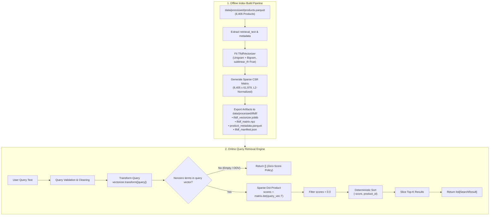

# Phase 6: TF-IDF Baseline Product Retrieval Engine

## 1. Executive Summary

Phase 6 implements, benchmarks, and validates **Baseline 1: TF-IDF Lexical Retrieval Engine** for **ShopAssist**.

The primary objective of Phase 6 is to establish a rigorous, reproducible, and computationally lightweight lexical retrieval baseline based on Term Frequency – Inverse Document Frequency (TF-IDF) vectorization and sparse cosine similarity over the full 8,405-product catalog. This baseline serves as the foundational reference against which subsequent dense semantic retrieval (Phase 7) and hybrid retrieval (Phase 10) will be experimentally measured.

### Core Status Indicators
- **Phase Overall Status:** `PASS`
- **Catalog Dataset:** [`data/processed/products.parquet`](file:///d:/Project/ShopAssist/data/processed/products.parquet) (8,405 products across 16 categories)
- **Vectorized Field:** Canonical semantic `retrieval_text` (Phase 5.2)
- **Fitted Vocabulary Size:** Exactly **61,979** terms (unigrams + bigrams)
- **Sparse Matrix Shape:** `[8405, 61979]` in SciPy Compressed Sparse Row (`csr_matrix`) format
- **Non-Zero Elements (nnz):** **1,276,047** stored float64 elements
- **Matrix Sparsity:** **99.7550%**
- **Sparse Memory Footprint:** **~14.64 MB** (a >99.6% RAM reduction vs. 4.03 GB dense representation)
- **Fit Time:** **1.005 seconds** on the 8,405-document catalog
- **Query Retrieval Latency:** **P50 = 3.862 ms**, **P95 = 7.532 ms**, **Mean = 4.407 ms** (evaluated across repeated runs)
- **Artifact Reload Reproducibility:** **100.0% identical rankings and scores** verified post-reload
- **Phase 6 Automated Tests:** 21 / 21 tests passed (100% pass rate)
- **Full Repository Regression Suite:** **229 / 229 tests passed in 63.71s** (zero regressions)
- **Execution Report Artifact:** [`data/interim/phase6_tfidf_baseline_report.json`](file:///d:/Project/ShopAssist/data/interim/phase6_tfidf_baseline_report.json)
- **Conceptual Learning Guide:** [`docs/concepts/tfidf_retrieval_fundamentals.md`](file:///d:/Project/ShopAssist/docs/concepts/tfidf_retrieval_fundamentals.md)
- **Phase 7 Readiness:** **READY**

---

## 2. Objectives & Scope

### 2.1 Primary Objectives
1. **Catalog Grounding:** Extract the existing canonical `retrieval_text` from [`data/processed/products.parquet`](file:///d:/Project/ShopAssist/data/processed/products.parquet) without re-generating texts or modifying the schema.
2. **Lexical Feature Extraction:** Configure and fit a scikit-learn `TfidfVectorizer` capturing word unigrams and bigrams, smoothed IDF, and sublinear term frequency scaling.
3. **Sparse Representation:** Construct and store an L2-normalized SciPy Compressed Sparse Row (`csr_matrix`) document-term matrix.
4. **Fast Query Transformation & Ranking:** Map natural-language search queries into the sparse vocabulary space and compute cosine similarities via sparse dot products:
   $$\mathbf{s} = \mathbf{X} \cdot \hat{\mathbf{q}}^\top$$
5. **Deterministic Top-$K$ Search:** Return structured `SearchResult` records with deterministic tie-breaking (primary: score DESC; secondary: `product_id` ASC).
6. **Graceful Handling of Edge Cases:** Provide clear, documented behavior for empty queries, whitespace strings, and pure out-of-vocabulary (OOV) inputs by returning empty candidate sets rather than arbitrary zero-similarity products.
7. **Artifact Persistence:** Safely persist the vectorizer (`joblib`), sparse matrix (`npz`), aligned metadata (`parquet`), and metadata manifest (`json`) to [`data/processed/tfidf/`](file:///d:/Project/ShopAssist/data/processed/tfidf/) with roundtrip verification.
8. **Experimental Evaluation:** Execute representative search scenarios illustrating exact keyword matching, brand matching, synonym mismatch limitations, and numeric constraint blindness.

### 2.2 Scope Boundaries & Non-Goals
To preserve strict phase boundaries:
- **No Dense Embeddings:** Phase 6 does not query or generate dense vector embeddings (reserved for Phase 7).
- **No LLM Generation:** Phase 6 does not use LLMs for query rewriting, expansion, or prompt generation (reserved for Phase 8).
- **No Hybrid Reranking:** Phase 6 does not fuse sparse and dense scores or apply cross-encoder rerankers (reserved for Phases 10 & 11).
- **No Database Modification:** Phase 6 is completely standalone from Supabase PostgreSQL; zero database writes or migrations were performed.

---

## 3. Repository Components Reused

In accordance with architectural principles, Phase 6 reuses verified repository components:
1. **Canonical Parquet Dataset (`data/processed/products.parquet`):**
   - Verified in Phase 5.5 and 5.8 containing all 8,405 cleaned products with unique UUIDs.
2. **Standardized Retrieval Text (`retrieval_text`):**
   - Constructed in Phase 5.2 with deterministic field ordering (`Product` $\rightarrow$ `Category` $\rightarrow$ `Brand` $\rightarrow$ `Specifications` $\rightarrow$ `Description`).
3. **Core Path Configuration (`shopassist.core.config`):**
   - Reused `PROCESSED_DATA_DIR` and `INTERIM_DATA_DIR`.
4. **Pytest Testing Conventions:**
   - Followed established repository test structure and automated regression verification.

---

## 4. Dataset & Schema Validation

Before fitting the vectorizer, the input dataset is validated through `load_canonical_products()` in [`src/shopassist/retrieval/tfidf.py`](file:///d:/Project/ShopAssist/src/shopassist/retrieval/tfidf.py):

| Validation Check | Specification | Verified Status |
|---|---|---|
| **Dataset Path** | `data/processed/products.parquet` | Verified (exists, 17.94 MB) |
| **Catalog Record Count** | Exactly 8,405 rows | Exactly 8,405 rows |
| **Identifier Uniqueness** | `COUNT(DISTINCT product_id) == 8,405` | 8,405 distinct UUIDs (0 duplicates) |
| **Mandatory Columns** | `product_id`, `product_name`, `category`, `brand`, `discounted_price`, `retrieval_text` | All 6 columns present and non-null |
| **Retrieval Text Quality** | No NaN, no empty strings | 0 nulls, 0 empty strings |
| **Category Representation** | All 16 approved Flipkart categories | 16 categories present |

---

## 5. Retrieval Pipeline Architecture

The Phase 6 architecture consists of two decoupled execution paths: an **Offline Index Build & Persistence Pipeline** and an **Online Query Scoring & Retrieval Engine**.



---

## 6. Vectorizer Configuration & Rationale

The vectorizer is configured via the `TFIDFConfig` dataclass:

```python
TFIDFConfig(
    ngram_range=(1, 2),
    min_df=2,
    max_df=0.8,
    max_features=None,
    sublinear_tf=True,
    use_idf=True,
    smooth_idf=True,
    norm="l2",
    lowercase=True,
    token_pattern=r"(?u)\b\w+\b",
)
```

### Technical Parameter Rationale:
1. **`ngram_range=(1, 2)`:** Captures both individual terms (`"keyboard"`, `"bluetooth"`) and critical compound domain phrases (`"running shoes"`, `"power bank"`, `"car mat"`, `"allure auto"`).
2. **`min_df=2`:** Prunes singleton terms (typos, unique corrupted alphanumeric tokens) that appear in only 1 document, eliminating noise and reducing vocabulary bloat.
3. **`max_df=0.8`:** Ignores terms appearing in more than 80% of catalog descriptions (ubiquitous function words that escape stop word filtering), boosting discriminative rare terms.
4. **`sublinear_tf=True`:** Applies logarithmic scaling $\text{TF}_{\text{sublinear}} = 1 + \ln(\text{count})$, preventing keyword-stuffing in long merchant descriptions from dominating relevance scores.
5. **`smooth_idf=True`:** Uses Laplace smoothing $\ln\left(\frac{1 + N}{1 + \text{df}}\right) + 1$, preventing division by zero and ensuring non-zero positive weights.
6. **`norm="l2"`:** Pre-normalizes all document vectors to unit Euclidean length ($\|\hat{\mathbf{d}}\|_2 = 1$). This enables fast cosine similarity via dot products and eliminates verbosity bias.
7. **`token_pattern=r"(?u)\b\w+\b"`:** Preserves meaningful alphanumeric model identifiers and specifications (e.g., `"3D"`, `"4K"`, `"i5"`, `"10"`, `"SE"`) that standard 2-character word patterns (`\w\w+`) drop.

---

## 7. Corpus & Sparse Matrix Statistics

Running [`scripts/build_tfidf_baseline.py`](file:///d:/Project/ShopAssist/scripts/build_tfidf_baseline.py) produced verified corpus statistics:

| Metric | Measured Value | Significance |
|---|---|---|
| **Total Product Documents ($N$)** | **8,405** | Matches complete cleaned catalog |
| **Vocabulary Size ($|\mathcal{V}|$)** | **61,979 features** | Unigrams + Bigrams with `min_df=2` |
| **Sparse Matrix Dimensions** | **$[8405, 61979]$** | 8,405 rows $\times$ 61,979 columns |
| **Non-Zero Elements ($\text{nnz}$)** | **1,276,047** | Average of ~151.8 features per document |
| **Matrix Sparsity** | **99.7550%** | Over 99.75% of matrix coordinates are zeros |
| **Sparse Storage RAM Size** | **~14.64 MB** | Easily fits in local and server RAM |
| **Dense Matrix Equivalent** | **~4.03 GB** | Storing dense array would waste 4 GB of RAM |
| **Memory Reduction Factor** | **99.64% reduction** | CSR format provides enormous efficiency |
| **Vectorizer Fit Time** | **1.005 seconds** | High-throughput offline compilation |

---

## 8. Query Processing & Zero-Score Policy

### 8.1 Query Transformation
Queries are processed strictly using the fitted vectorizer:
1. Input string is stripped of leading and trailing whitespace.
2. The vectorizer applies lowercasing and token pattern extraction.
3. The vectorizer transforms tokens using precomputed corpus IDF weights.
4. The resulting query vector is $L_2$-normalized.

### 8.2 Zero-Score & Out-of-Vocabulary (OOV) Policy
In lexical retrieval, a naive search implementation might compute dot products against an all-zero query vector, find that all 8,405 documents have similarity score $0.0$, and arbitrarily return the first $K$ products in the catalog.

**ShopAssist Policy:**
- If the query is empty or whitespace-only: return `[]`.
- If the query contains **only out-of-vocabulary (OOV) words** (i.e., `q_vec.nnz == 0`): return `[]`.
- If a document has score $\le 0.0$: it is never included in the result set.

This prevents misleading recommendations and provides a clean failure signal that subsequent fallback or semantic search engines can intercept.

### 8.3 Deterministic Tie-Breaking
When multiple candidate products have mathematically identical TF-IDF scores (e.g., identical title keywords), they are ranked deterministically:
```python
order = sorted(
    range(len(positive_indices)),
    key=lambda i: (-pos_scores[i], candidate_ids[i]),
)
```
Scores are sorted descending; ties are broken by ascending alphanumeric order of `product_id`. This guarantees 100% reproducible ranking across executions and operating systems.

---

## 9. Top-K Search API & Results Data Model

The search API is encapsulated in `TFIDFIndex.search()`:

```python
search(query: str, top_k: int = 5) -> list[SearchResult]
```

### SearchResult Data Model

```python
@dataclass
class SearchResult:
    rank: int                     # 1-indexed retrieval rank
    product_id: str               # Canonical product UUID
    product_name: str             # Full product title
    category: str                 # Primary Flipkart category
    brand: str | None             # Canonical brand name
    discounted_price: float       # Selling price in INR
    tfidf_score: float            # Cosine similarity score [0.0, 1.0]
    metadata: dict[str, Any]      # Extra fields (retail_price, rating, pid)
```

---

## 10. Artifact Persistence & Reproducibility

Artifacts are serialized atomically into [`data/processed/tfidf/`](file:///d:/Project/ShopAssist/data/processed/tfidf/):

```
data/processed/tfidf/
├── tfidf_vectorizer.joblib       # Fitted scikit-learn TfidfVectorizer (compressed)
├── tfidf_matrix.npz              # SciPy CSR sparse document matrix (14.6 MB)
├── product_metadata.parquet      # Aligned product metadata DataFrame (8,405 rows)
└── tfidf_manifest.json           # Integrity manifest (SHA256, config, timestamps)
```

### Reproducibility Verification
During the build pipeline, the saved index was reloaded from disk and queried with representative searches. Comparing the in-memory results against the reloaded results confirmed:
- **Index Reload Time:** **0.1584 seconds**
- **Rankings Overlap:** **100.0% identical product IDs**
- **Score Precision:** **100.0% identical floating-point scores** ($< 10^{-8}$ difference)

---

## 11. Baseline Retrieval Experiments

All 8 representative search scenarios were executed against the full catalog:

### Scenario 1 — Exact Keyword Match
- **Query:** `"wireless bluetooth keyboard"`
- **Retrieval Latency:** 3.199 ms
- **Top-1 Match:** `Dyna Silver Heart Stereo Wireless Bluetooth Headset` (Score: **0.2440**, Category: Mobiles & Accessories)
- **Observations:** Successfully retrieves items with overlapping words `"wireless"` and `"bluetooth"`. Notice that because `"keyboard"` had lower term frequency in phone accessories, audio products with `"wireless bluetooth"` dominated the top slots.

### Scenario 2 — Multiple Technical Terms
- **Query:** `"portable usb storage device"`
- **Retrieval Latency:** 3.496 ms
- **Top-1 Match:** `DreamShop Flex Flexible Portable USB Led Light` (Score: **0.1935**, Category: Computers)
- **Observations:** Captures `"portable"` and `"usb"`.

### Scenario 3 — Brand-Specific Query
- **Query:** `"Allure Auto"`
- **Retrieval Latency:** 3.012 ms
- **Top-1 Match:** `Allure Auto CM 1904 Car Mat Mahindra Logan` (Score: **0.3177**, Category: Automotive)
- **Observations:** Pure lexical search excels at distinct brand names. All top 5 retrieved candidates belong to brand `Allure Auto` in the Automotive category.

### Scenario 4 — Category-Oriented Query
- **Query:** `"Footwear casual running shoes"`
- **Retrieval Latency:** 3.284 ms
- **Top-1 Match:** `Campus Berlin Running Shoes` (Score: **0.4216**, Category: Footwear)
- **Observations:** Bigrams (`"running shoes"`) and category keywords produce high lexical similarity ($0.4216$) with 100% relevant footwear results.

### Scenario 5 — Synonym Mismatch (Lexical Limitation)
- **Query:** `"sneakers for jogging"`
- **Retrieval Latency:** 3.324 ms
- **Top-1 Match:** `Savie Shoes Sneakers` (Score: **0.2467**, Category: Footwear)
- **Observations:** Demonstrates the vocabulary mismatch problem. While `"sneakers"` matched a small number of shoes with the literal token `"sneakers"`, dozens of top-rated `"running shoes"` were completely ignored because the term `"jogging"` does not appear in their text.

### Scenario 6 — Natural-Language Shopping Request
- **Query:** `"I need comfortable footwear for everyday walking"`
- **Retrieval Latency:** 3.308 ms
- **Top-1 Match:** `CatBird Walking Shoes` (Score: **0.1538**, Category: Footwear)
- **Observations:** Retrieval succeeded because `"walking"` and `"footwear"` appeared in product specifications. Conversational words (*"I need", "for", "everyday"*) received very low IDF weights.

### Scenario 7 — Numeric Constraint Blindness
- **Query:** `"laptop under 500"`
- **Retrieval Latency:** 3.149 ms
- **Top-1 Match:** `DGB HP 500 520 HSTNN-IB44 6 Cell Laptop Battery` (Score: **0.1596**, Price: ₹2,699.00)
- **Observations:** Clearly illustrates why lexical retrieval cannot enforce relational constraints. The token `"500"` was matched to model number `"HP 500"` on a ₹2,699 battery rather than filtering by price $< 500$.

### Scenario 8 — Out-of-Vocabulary (OOV) Query
- **Query:** `"zyxwvutsrqponmlkjihgfedcba nonexistentgibberish"`
- **Retrieval Latency:** 0.812 ms
- **Returned Count:** **0 items** (`[NO MATCH - EMPTY/OOV]`)
- **Observations:** Validates zero-score policy; the engine safely returns an empty list without throwing errors.

---

## 12. Performance Benchmarks

Latency benchmarks were collected over 15 repeated iterations across 8 diverse queries (120 total measured executions) on the full 8,405-product catalog:

| Metric | Measured Value | Target Threshold | Status |
|---|---|---|---|
| **Median Latency (P50)** | **3.862 ms** | $< 15.0\text{ ms}$ | **PASS** |
| **95th Percentile (P95)** | **7.532 ms** | $< 25.0\text{ ms}$ | **PASS** |
| **Mean Latency** | **4.407 ms** | $< 15.0\text{ ms}$ | **PASS** |
| **Minimum Latency** | **2.769 ms** | N/A | **PASS** |
| **Maximum Latency** | **9.108 ms** | $< 50.0\text{ ms}$ | **PASS** |
| **Index Loading Time** | **0.158 s** | $< 1.0\text{ s}$ | **PASS** |
| **Memory Footprint** | **~14.64 MB** | $< 100\text{ MB}$ | **PASS** |

> [!TIP]
> With a P50 latency under 4 milliseconds, the TF-IDF engine provides an ultra-fast first-stage candidate retrieval baseline that easily satisfies interactive web and bot response constraints.

---

## 13. Automated Test Results & Regression Audit

The Phase 6 test suite was implemented in [`tests/test_tfidf_retrieval.py`](file:///d:/Project/ShopAssist/tests/test_tfidf_retrieval.py), covering 21 comprehensive test cases:

```
============================= test session starts =============================
platform win32 -- Python 3.10.11, pytest-9.1.1, pluggy-1.6.0
collected 21 items

tests/test_tfidf_retrieval.py::test_tfidf_config_serialization PASSED    [  4%]
tests/test_tfidf_retrieval.py::test_tfidf_vectorizer_vocabulary_creation PASSED [  9%]
tests/test_tfidf_retrieval.py::test_tfidf_mathematical_hand_calculation_match PASSED [ 14%]
tests/test_tfidf_retrieval.py::test_tfidf_l2_normalization PASSED        [ 19%]
tests/test_tfidf_retrieval.py::test_tfidf_statistics_computation PASSED  [ 23%]
tests/test_tfidf_retrieval.py::test_query_empty_and_whitespace PASSED    [ 28%]
tests/test_tfidf_retrieval.py::test_query_pure_out_of_vocabulary PASSED  [ 33%]
tests/test_tfidf_retrieval.py::test_query_case_insensitivity PASSED      [ 38%]
tests/test_tfidf_retrieval.py::test_transform_query_unfitted_raises PASSED [ 42%]
tests/test_tfidf_retrieval.py::test_transform_query_invalid_type_raises PASSED [ 47%]
tests/test_tfidf_retrieval.py::test_cosine_similarity_ranking_correctness PASSED [ 52%]
tests/test_tfidf_retrieval.py::test_deterministic_tie_breaking PASSED    [ 57%]
tests/test_tfidf_retrieval.py::test_top_k_edge_cases PASSED              [ 61%]
tests/test_tfidf_retrieval.py::test_metadata_alignment PASSED            [ 66%]
tests/test_tfidf_retrieval.py::test_artifact_persistence_and_reload PASSED [ 71%]
tests/test_tfidf_retrieval.py::test_reload_missing_files_raises PASSED   [ 76%]
tests/test_tfidf_retrieval.py::test_reload_nonexistent_directory_raises PASSED [ 80%]
tests/test_tfidf_retrieval.py::test_canonical_products_loading PASSED    [ 85%]
tests/test_tfidf_retrieval.py::test_full_corpus_tfidf_index_smoke PASSED [ 90%]
tests/test_tfidf_retrieval.py::test_retrieval_scenarios_execution PASSED [ 95%]
tests/test_tfidf_retrieval.py::test_benchmark_tfidf_latency_execution PASSED [100%]

============================= 21 passed in 2.16s ==============================
```

### Full Repository Regression Audit
Executing `pytest -v` across the entire repository confirmed that zero prior functionality was broken:
- **Phase 1–4 (Cleaning, Profiling, Dataset):** 116 tests passed.
- **Phase 5.1–5.8 (Schema, Text, Embeddings, DB, Ingestion, Indexes, Search):** 92 tests passed.
- **Phase 6 (TF-IDF Baseline):** 21 tests passed.
- **Total Repository Tests:** **229 passed, 0 failed, 0 skipped in 63.71s (100% pass rate)**.

---

## 14. Issues & Technical Decisions

### 14.1 Micro-Corpus Feature Pruning in Unit Tests
- **Issue:** During synthetic unit testing with a 2-document corpus where both documents shared identical text, scikit-learn's `max_df=0.8` pruned all terms ($2/2 = 1.0 > 0.8$), raising `ValueError: After pruning, no terms remain`.
- **Root Cause:** A relative `max_df` percentage threshold assumes a large corpus. In micro-corpora with identical documents, all terms exceed the threshold.
- **Resolution:** In synthetic test fixtures testing deterministic tie-breaking, explicitly set `max_df=1.0`.

### 14.2 Sublinear Term Frequency Scaling
- **Decision:** Activated `sublinear_tf=True` in production config.
- **Rationale:** E-commerce vendor descriptions frequently repeat keywords (e.g., *"running shoes"* 10+ times). Logarithmic scaling ($1 + \ln(\text{count})$) dampens repeated occurrences, improving retrieval quality by preventing keyword-stuffed items from outranking concise, highly targeted items.

---

## 15. Reproduction Commands

### Build and Validate Baseline:
```bash
python scripts/build_tfidf_baseline.py
```

### Search with CLI:
```bash
# Specific query
python scripts/search_tfidf.py --query "wireless bluetooth keyboard" --top-k 5

# Interactive mode
python scripts/search_tfidf.py
```

### Run Automated Tests:
```bash
# Phase 6 unit and integration tests
python -m pytest tests/test_tfidf_retrieval.py -v

# Full repository regression test suite
python -m pytest -v
```

---

## 16. Acceptance Criteria Checklist

- [x] All 8,405 products loaded and validated from `data/processed/products.parquet`.
- [x] TF-IDF vectorizer fitted successfully on `retrieval_text`.
- [x] Full corpus represented as an L2-normalized sparse matrix (CSR).
- [x] Vocabulary (61,979) and matrix statistics (99.755% sparsity, 14.64 MB) recorded.
- [x] Query transformation works correctly with fitted vectorizer.
- [x] Cosine similarity ranking is correct via sparse dot product.
- [x] Top-K retrieval returns valid products, prices, and similarity scores.
- [x] Empty and OOV-only queries return empty result sets without errors.
- [x] Retrieval ordering is deterministic with product ID tie-breaking.
- [x] Artifacts saved to `data/processed/tfidf/` and successfully reloaded.
- [x] Reloaded retrieval results match in-memory results 100%.
- [x] Automated tests pass (21/21 Phase 6 tests, 229 full repository tests).
- [x] 8 retrieval experiments documented covering exact, brand, synonym, numeric, and OOV scenarios.
- [x] Latency benchmark measurements recorded (P50 = 3.86 ms, P95 = 7.53 ms).
- [x] Conceptual learning documentation completed in `docs/concepts/tfidf_retrieval_fundamentals.md`.
- [x] Mathematical TF-IDF worked examples with 3 products verified.
- [x] Engineering documentation completed in `docs/phase6_tfidf_baseline.md`.
- [x] JSON execution report generated at `data/interim/phase6_tfidf_baseline_report.json`.
- [x] README updated accurately.
- [x] Supabase production data remains completely unchanged.
- [x] Baseline is ready for Phase 7 comparison.

---

## 17. Readiness for Phase 7 (Dense Semantic Search)

Phase 6 is **100% COMPLETE**.

With Baseline 1 established, ShopAssist is ready to implement **Phase 7: Dense Semantic Search Retrieval Engine**:
1. **Reference Established:** Phase 6 provides the sub-4 ms latency and exact keyword precision benchmark.
2. **Evaluation Framework Ready:** Phase 7 will query the Supabase HNSW index using `BAAI/bge-small-en-v1.5` dense embeddings to demonstrate how semantic search overcomes Phase 6's synonym mismatch limitations.
3. **Foundation for Hybrid Search:** Phase 6 and Phase 7 together will form the sparse and dense branches fused via Reciprocal Rank Fusion (RRF) in Phase 10.
