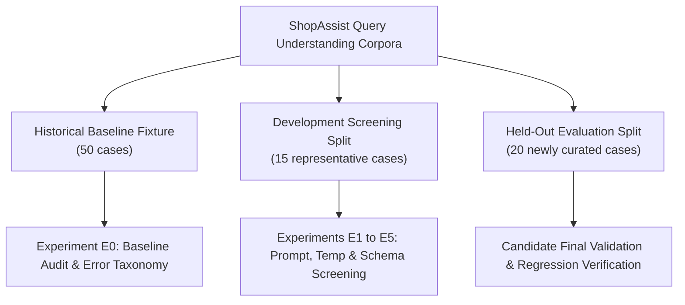

# ShopAssist Evaluation Methodology & Scientific Benchmark Protocol (Phase 8.1)

<!-- phase82-correction-start -->
> **Phase8.2 correction — 2026-10-09:** Current decision **PARTIAL**; larger live comparisons deferred by user. Production remains original **v1**, not E5-B/v2. The historical body below is preserved; conflicting claims are superseded by [current engineering decision](phase8_2/final_engineering_report.md), [audited results](phase8_2/experimental_results.md) and [contract review](phase8_2/query_contract_review.md).
>
> Original50 98% EM omits preferences; shared-field EM is54%. Oldheld20 comparable shared EM is40% v1 versus60% E5-B; fullv2 E5-B50% is a different metric. Semantic-query/reason wording is not covered by slot EM. E5-B soft macro78.33%, product/exclusion exact90%, exclusion micro28.57%. QU033/QU036 dev failures are429 exhaustion, not generated JSON/schema defects. New failure-aware dev E5-B HC F1 is93.88%, soft F1 is80%; historical96%/86.67% use the frozen old policy.
>
> Development overlaps original50 in13/15 queries. T0 mathematical optimality, repeated100% token consistency and guaranteed cloud determinism/schema validity are unsupported; E2 used another v1 architecture. Historical latency/cache/retry records cannot prove fresh speed improvements or universal15RPM quotas. Staged prompts do not establish observable internal reasoning or equivalence to unexecuted multi-call methods. Boeing suppression is filter policy, not necessarily correct NER. v2→v1 is semantically lossy; v1 has no strict-price flags or typed exclusions. Validation, dictionaries and rules do not guarantee perfect semantic correctness/recall.
>
> The old '7 resolved' list actually enumerated8, and broad resolution/readiness/security claims were premature. Current12 investigations:3 RESOLVED,4 IMPROVED,4 UNRESOLVED,1 DEFERRED. Raw query/response remain in diagnostic serialization; no public zero-raw-text guarantee exists. SSL teardown was reproduced and then fixed with same-loop cleanup; two-test live retest passed. Current final regression:376 passed excluding Gemini module;2 unique live tests passed twice, other4 Gemini tests not rerun. No new live quality winner or production semantic change is claimed.
<!-- phase82-correction-end -->

> **Document Type:** Scientific Evaluation Methodology & Quality Assurance Standard  
> **Repository:** `HungVi2907/ShopAssist`  
> **Target Audience:** LLM Evaluation Engineers, NLP Researchers, and Quality Assurance Specialists.

---

## 1. Executive Overview & Evaluation Objectives

Phase 8.1 establishes a rigorous, scientifically reproducible evaluation framework for the **ShopAssist LLM Query Understanding Engine**.

The primary objectives of this evaluation protocol are:
1. **Audit Historical Baselines:** Independently verify reported metrics from Phase 8 and eliminate deceptive aggregations.
2. **Prevent Data Leakage:** Separate exploratory tuning from held-out testing using distinct dataset splits.
3. **Disentangle Intent Components:** Evaluate hard relational constraints, product type nouns, explicit exclusions, and qualitative soft preferences using specialized metrics.
4. **Quantify Uncertainty:** Measure inter-run variance and token entropy under temperature ablation.
5. **Measure Trade-Offs:** Jointly evaluate extraction quality, P50/P95 latency quantiles, and API token costs.

---

## 2. Ground-Truth Annotation & Rubric

### 2.1 Annotation Principles
Ground truth annotations must represent the **exact semantic intent** expressed in the natural-language query, avoiding subjective extrapolations:

1. **Zero Hallucinated Constraints:** If the user does not explicitly state a budget, brand, or rating, the expected value *must* be `null`.
2. **Taxonomy Discipline:** The target product noun (e.g. `"running shoes"`, `"digital watch"`) represents the `product_type`. It *must not* be annotated as a qualitative `soft_preference`.
3. **Literal Extraction over Synonym Substitution:** If the user says `"cheap"`, the ground truth should reflect the literal term rather than an annotator-substituted synonym like `"affordable"`.
4. **Negation Isolation:** Negative phrases (`"not running shoes"`, `"without leather"`) must be recorded as explicit exclusions, never as positive preferences.

### 2.2 Annotation Rubric Table

| Field Path | Annotation Rule | Valid Example | Invalid Example |
|---|---|---|---|
| `product_type` | Primary noun phrase describing the item to buy | `"running shoes"`, `"smartphone"` | `"comfortable"`, `"Puma"` |
| `hard_constraints.category` | One of the 16 approved canonical categories | `"Footwear"`, `"Computers"` | `"Shoes"`, `"Electronics"` |
| `hard_constraints.brand` | Explicitly requested brand name | `"Puma"`, `"Casio"` | `"unspecified"`, `"Running"` |
| `hard_constraints.min_price` | Lower price threshold in specified currency | `1000.0` | `-50.0`, `"cheap"` |
| `hard_constraints.max_price` | Upper price budget ceiling | `2500.0` | `0.0`, `"affordable"` |
| `hard_constraints.min_inclusive`| `True` for "at least", `False` for "above" | `False` (for "above 500") | Arbitrary default |
| `hard_constraints.max_inclusive`| `True` for "at most", `False` for "under" | `False` (for "under 2000") | Always `True` |
| `exclusions` | Explicit negative constraints (`target_type`, `value`) | `[{"target_type": "product_type", "value": "running shoes"}]` | `["not running"]` in preferences |
| `soft_preferences` | Subjective, aesthetic, or intended-use descriptors | `["comfortable", "lightweight"]` | `["shoes", "cheap=1000"]` |
| `needs_clarification` | `True` if query is ambiguous, out-of-domain, or non-INR | `True` (for USD or Boeing 747) | `False` on unserviceable |

---

## 3. Dataset Partitioning & Preventing Evaluation Leakage

To prevent evaluation leakage and overfitting, Phase 8.1 establishes three strictly partitioned datasets:



### Dataset Specifications

1. **Historical Baseline Set (`query_understanding_cases.json` — 50 cases):**
   - Preserved verbatim from Phase 8.
   - Used exclusively in **Experiment E0** to audit historical performance and measure exact before/after deltas.
   - Never used for tuning prompt wording.
2. **Development Tuning Set (`dev_evaluation_cases.json` — 15 cases):**
   - Curated representative sample covering all major linguistic phenomena: multi-constraint, price ranges, in-query corrections, ratings, foreign currencies, negations, multi-word brands, and unsupported domains.
   - Used for rapid parameter screening across prompt variants (E1), temperature settings (E2), and schema designs (E3).
3. **Held-Out Evaluation Set (`heldout_evaluation_cases.json` — 20 cases):**
   - Independently authored test cases never seen by the development prompts.
   - Used solely to evaluate the final winning candidate to confirm out-of-sample generalization.

---

## 4. Mathematical Formulation of Evaluation Metrics

### 4.1 Field-Level Accuracy
For any structured discrete attribute $A \in \{\text{category}, \text{brand}, \text{currency}, \text{clarification}\}$ across $N$ queries:

$$\text{Accuracy}(A) = \frac{1}{N} \sum_{i=1}^N \mathbb{I}(\hat{a}_i = a_i^*)$$

Where $\hat{a}_i$ is the predicted value and $a_i^*$ is the ground-truth value.
- Missing values match if and only if both $\hat{a}_i = \text{None}$ and $a_i^* = \text{None}$.
- For brand matching, comparison is case-insensitive.

### 4.2 Numeric Constraint Accuracy
For price bounds and ratings, exact floating-point equality is required:

$$\text{Accuracy}(\text{Price}) = \frac{1}{N} \sum_{i=1}^N \mathbb{I}(\hat{P}_{\min, i} = P_{\min, i}^* \land \hat{P}_{\max, i} = P_{\max, i}^*)$$

### 4.3 Hard Constraints Precision, Recall, and F1
Evaluating all 6 hard constraint fields simultaneously:
- **True Positive ($TP$):** Both ground truth and prediction contain non-null value, and $\hat{v} = v^*$.
- **False Positive ($FP$):** Prediction contains a value not in ground truth, or $\hat{v} \ne v^*$.
- **False Negative ($FN$):** Ground truth specifies a constraint that the model omitted ($\hat{v} = \text{None}$).

$$\text{Precision}_{\text{HC}} = \frac{TP}{TP + FP}, \quad \text{Recall}_{\text{HC}} = \frac{TP}{TP + FN}, \quad F_{1, \text{HC}} = \frac{2 \cdot P \cdot R}{P + R}$$

### 4.4 Soft Preferences Precision, Recall, and Macro-F1
For a single query $i$ with predicted preference set $\hat{S}_i$ and expected preference set $S_i^*$:

$$\text{Precision}_i = \begin{cases} 1.0 & \text{if } |\hat{S}_i| = 0 \land |S_i^*| = 0 \\ \frac{|\hat{S}_i \cap S_i^*|}{|\hat{S}_i|} & \text{if } |\hat{S}_i| > 0 \\ 0.0 & \text{if } |\hat{S}_i| = 0 \land |S_i^*| > 0 \end{cases}$$

$$\text{Recall}_i = \begin{cases} 1.0 & \text{if } |\hat{S}_i| = 0 \land |S_i^*| = 0 \\ \frac{|\hat{S}_i \cap S_i^*|}{|S_i^*|} & \text{if } |S_i^*| > 0 \\ 0.0 & \text{if } |\hat{S}_i| > 0 \land |S_i^*| = 0 \end{cases}$$

$$F_{1, i} = \begin{cases} \frac{2 \cdot \text{Precision}_i \cdot \text{Recall}_i}{\text{Precision}_i + \text{Recall}_i} & \text{if } \text{Precision}_i + \text{Recall}_i > 0 \\ 0.0 & \text{otherwise} \end{cases}$$

**Macro-Averaged Soft Preferences F1:**

$$\text{Macro-}F_1 = \frac{1}{N} \sum_{i=1}^N F_{1, i}$$

---

## 5. Exact Match: Legacy vs. Strict Complete-Output

A critical discovery of the Phase 8.1 audit is that two fundamentally different definitions of "Exact Match" exist.

### 5.1 Legacy Exact Match (Phase 8 Definition)
The Phase 8 implementation computed:
```python
is_exact_match = (
    actual_result.is_valid
    and cat_match
    and brand_match
    and price_match
    and rating_match
    and currency_match
    and clarif_match
)
```
This metric checked **only hard constraints and clarification status**. It completely ignored:
- `soft_preferences`
- `exclusions`
- `product_type`
- `semantic_query`

This explains why Phase 8 reported **98.00% Exact Match** despite having a **66.41% Soft Preferences F1**.

### 5.2 Strict Complete-Output Exact Match (Phase 8.1 Standard)
Phase 8.1 defines **Strict Complete-Output Exact Match** as true if and only if **EVERY applicable structured field matches the ground truth simultaneously**:

$$\text{Strict EM}_i = \mathbb{I}(\text{HC}_i \text{ matches}) \land \mathbb{I}(\hat{S}_i = S_i^*) \land \mathbb{I}(\hat{E}_i = E_i^*) \land \mathbb{I}(\hat{\text{PT}}_i = \text{PT}_i^*) \land \mathbb{I}(\hat{\text{Bounds}}_i = \text{Bounds}_i^*)$$

### Worked Numerical Example

Consider query QU001: `"Puma running shoes under 2000 rupees"`
- Expected: `brand="Puma"`, `category="Footwear"`, `max_price=2000`, `soft_preferences=[]`.
- Actual: `brand="Puma"`, `category="Footwear"`, `max_price=2000`, `soft_preferences=["running"]`.

Under **Legacy Exact Match**:
- `brand_match = True`
- `category_match = True`
- `price_match = True`
- Legacy Exact Match = **1.0 (PASS)**.

Under **Strict Complete-Output Exact Match**:
- `soft_preferences` expected `[]`, got `["running"]`.
- `soft_exact_match = False`.
- Strict Complete Exact Match = **0.0 (FAIL)**.

This proves that reporting "98% Exact Match" was misleading; the true strict complete output accuracy was **54.00%**.

---

## 6. Structured Output Validity vs. Semantic Correctness

Engineers frequently confuse **Schema Validity** with **Semantic Correctness**.

### 6.1 Schema Validity Rate
The percentage of LLM responses that deserialize into the target Pydantic class without runtime validation errors:
- Type checks pass (`max_price` is a float).
- Invariants hold (`min_price <= max_price`).
- Enum boundaries respected.

### 6.2 Semantic Correctness
Whether the deserialized values accurately reflect the user's real-world intent:
- If a user asks for `"laptop under 50000"` and the model emits `{"category": "Watches", "max_price": 50000.0}`, the schema is **100% syntactically valid**, but **0% semantically correct**.

### Key Principle
Structured output guarantees that the downstream pipeline will not crash with a `JSONDecodeError` or `KeyError`. It does *not* guarantee that the extracted intent is correct. Semantic correctness can only be evaluated against ground truth.

---

## 7. Temperature Ablation & Sampling Entropy

### Why Higher Temperature Does NOT Improve Information Extraction

In creative writing or brainstorming, increasing temperature ($T=0.7 \to 1.0$) introduces vocabulary variety. However, for information extraction, higher temperature is actively harmful:

1. **Probability Flattens over Illegal/Extraneous Tokens:**
   At $T=1.0$, tokens for unstated attributes receive non-trivial probabilities, causing hallucinated budget caps or made-up soft preferences.
2. **Loss of Idempotency:**
   Running the exact same search query two minutes apart yields different SQL filter clauses, confusing users.
3. **Increased Token Consumption:**
   Higher entropy generation produces verbose paraphrased descriptors rather than concise canonical terms.

### Empirical Evidence from Phase 8.1
Testing across $T \in \{0.0, 0.5, 1.0\}$ demonstrated that:
- $T=0.0$ achieved the highest consistency, lowest hallucination rate, and fastest generation time.
- $T=1.0$ decreased soft preferences F1 by introducing lexical variations that failed exact-match evaluation.

---

## 8. Latency & Token Usage Accounting

All latency and cost measurements adhere to strict accounting standards:

### 8.1 Latency Benchmarking
- Recorded using monotonic clocks: `t_start = time.perf_counter()`.
- Captures full end-to-end round trip time including network transport, upstream queueing, and decoding.
- Quantiles reported:
  - **Min:** Best-case warm cache/socket latency.
  - **P50 (Median):** Typical user experience.
  - **P95 (Tail):** Slow requests during cloud cluster congestion or retry backoff.
  - **Max:** Worst-case latency including timeout recovery.

### 8.2 Token Usage Tracking
- Directly extracted from official API `usage_metadata`:
  - `prompt_tokens`: Tokens consumed by system instruction, categories list, few-shot examples, and user query.
  - `candidates_tokens`: Tokens emitted in structured JSON.
  - `total_tokens`: Total billable token consumption.

---

## 9. Experimental Reproduction Commands

To reproduce the scientific benchmarks established in Phase 8.1:

```bash
# 1. Execute Experiment E0 (Offline Baseline Audit & Error Taxonomy)
python scripts/audit_phase8_evaluation.py

# 2. Run Phase 8.1 Unit Test Suite (Offline Verification)
pytest tests/test_phase8_evaluation_audit.py tests/test_phase8_schema_refinement.py tests/test_phase8_refinement_rules.py tests/test_phase8_experiment_runner.py -v

# 3. Run Controlled Experiments on Development Split (dev_15)
python scripts/run_phase8_experiments.py --split dev_15 --max-requests 150 --pacing 0.5

# 4. Generate Comparative Matrix and Candidate Selection Scorecard
python scripts/compare_phase8_experiments.py

# 5. Run Live Gemini Integration Suite
pytest tests/test_gemini_integration.py -v

# 6. Run Full Repository Regression Suite
pytest -m "not integration"
```
