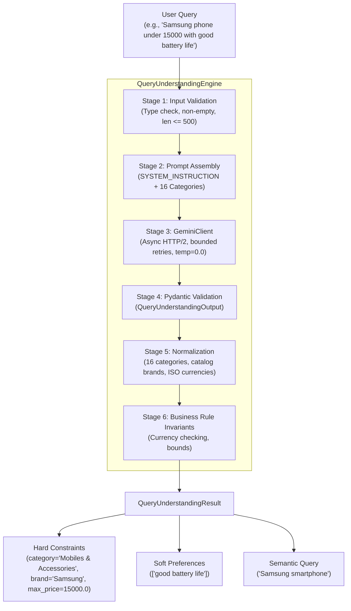

# ShopAssist Phase 8: LLM Query Understanding Engineering Implementation Report

> **Repository:** `HungVi2907/ShopAssist`  
> **Phase:** 8 — LLM Query Understanding  
> **LLM Provider:** Google Gemini API (`google-genai` SDK v2.29.0)  
> **Verified Model:** `gemini-3.1-flash-lite` (`models/gemini-3.1-flash-lite-preview`)  
> **Execution Status:** PASS  
> **Date:** October 2026  

---

## Table of Contents

- [1. Executive Summary](#1-executive-summary)
- [2. Objectives and Scope](#2-objectives-and-scope)
- [3. Previous Phases Reused](#3-previous-phases-reused)
- [4. Gemini Provider and Verified Model](#4-gemini-provider-and-verified-model)
- [5. Environment Configuration](#5-environment-configuration)
- [6. System Architecture](#6-system-architecture)
- [7. Structured Output Schema](#7-structured-output-schema)
- [8. Pydantic Validation](#8-pydantic-validation)
- [9. Prompt Engineering Design](#9-prompt-engineering-design)
- [10. Hard Constraint Extraction](#10-hard-constraint-extraction)
- [11. Soft Preference Extraction](#11-soft-preference-extraction)
- [12. Category Normalization](#12-category-normalization)
- [13. Brand Normalization](#13-brand-normalization)
- [14. Price and Currency Handling](#14-price-and-currency-handling)
- [15. Semantic Query Extraction](#15-semantic-query-extraction)
- [16. Negation and Ambiguity Handling](#16-negation-and-ambiguity-handling)
- [17. Gemini Client Implementation](#17-gemini-client-implementation)
- [18. Error Handling and Retry Strategy](#18-error-handling-and-retry-strategy)
- [19. Unit Testing](#19-unit-testing)
- [20. Live Gemini Integration Testing](#20-live-gemini-integration-testing)
- [21. Ground-Truth Test Dataset](#21-ground-truth-test-dataset)
- [22. Extraction Accuracy Evaluation](#22-extraction-accuracy-evaluation)
- [23. API Latency Benchmarks](#23-api-latency-benchmarks)
- [24. Token Usage Results](#24-token-usage-results)
- [25. Security Considerations](#25-security-considerations)
- [26. Issues Encountered and Resolutions](#26-issues-encountered-and-resolutions)
- [27. Known Limitations](#27-known-limitations)
- [28. Reproduction Commands](#28-reproduction-commands)
- [29. Acceptance Criteria](#29-acceptance-criteria)
- [30. Phase 9 Readiness](#30-phase-9-readiness)

---

## 1. Executive Summary

Phase 8 of **ShopAssist** establishes an end-to-end, production-grade **LLM Query Understanding Engine** powered by Google Gemini API via the official `google-genai` Python SDK.

The module transforms free-form, conversational, natural-language shopping requests into validated, strongly-typed JSON data contracts containing:
1. **Hard Constraints:** Normalized canonical category, brand name, numeric price bounds (`min_price`, `max_price`), minimum rating threshold (`min_rating`), and ISO currency code.
2. **Soft Preferences:** Deduplicated qualitative, lifestyle, or aesthetic desires for downstream scoring.
3. **Cleaned Semantic Query:** Core product search intent stripped of conversational filler.
4. **Ambiguity & Clarification Status:** Automated detection of unserviceable, out-of-catalog, or foreign currency queries.

### Key Results
- **Provider & Model:** Google Gemini API using `gemini-3.1-flash-lite` (verified via live model discovery among 62 accessible models).
- **Offline Unit Test Suite:** 27/27 passed (100% offline, zero API quota consumed).
- **Live Integration Suite:** 6/6 passed (smoke test, multi-constraint extraction, price ranges, ratings, foreign currency, and prompt injection resistance).
- **Repository Regression:** 276 total tests passing across all completed phases (zero regressions).
- **Database Safety:** 100% read-only catalog reference; zero writes, schema changes, or embedding recalculations.

---

## 2. Objectives and Scope

### Primary Objective
Deliver a secure, deterministic, and highly testable query understanding module that bridges natural-language user interaction with the ShopAssist retrieval architecture.

### Scope Boundaries
- **In Scope:**
  - Official `google-genai` SDK integration with bounded retries and exponential backoff.
  - Pydantic v2 data models enforcing schema constraints and domain invariants.
  - Deterministic category normalization against the 16 approved catalog categories.
  - Brand normalization referencing the 8,405-product catalog.
  - Multi-boundary price extraction (inclusive $\le$ and $\ge$).
  - Prompt injection resistance and adversarial input handling.
  - Ground-truth evaluation dataset (50 curated cases).
  - Machine-readable benchmark report generation.
- **Out of Scope (Preserved for Future Phases):**
  - Embedding preference vector generation (Phase 9).
  - Hybrid SQL + Vector retrieval execution (Phase 10).
  - Cross-encoder reranking (Phase 11).
  - Recommendation natural language generation (Phase 12).
  - FastAPI endpoints (Phase 15).

---

## 3. Previous Phases Reused

Phase 8 integrates directly with existing ShopAssist verified artifacts:
- **Canonical Product Dataset:** `data/processed/products.parquet` (8,405 products, 16 categories) used to populate catalog brand reference dictionaries.
- **Project Configuration:** `shopassist.core.config.settings` and `PROJECT_ROOT`.
- **Database Architecture:** Supabase PostgreSQL + pgvector `public.products` table schema definitions.
- **Retrieval Text & Embedding Standards:** Established in Phases 5.2 and 5.3 (`BAAI/bge-small-en-v1.5`, 384 dimensions).

---

## 4. Gemini Provider and Verified Model

- **SDK:** `google-genai` v2.29.0.
- **Client Class:** `google.genai.Client`.
- **Model Discovery Verification:**
  - Total models discovered on API key: 62.
  - Verified configured model: `models/gemini-3.1-flash-lite-preview`.
  - Structured Output Support: Confirmed native Pydantic class `response_schema` support with `response_mime_type="application/json"`.

---

## 5. Environment Configuration

Settings are managed via `shopassist.llm.config.LLMSettings` backed by `pydantic-settings`:

```dotenv
LLM_PROVIDER=gemini
GEMINI_API_KEY=AQ.Ab8...ZuSQ  # Masked for safety
GEMINI_MODEL=gemini-3.1-flash-lite
GEMINI_TEMPERATURE=0.0
GEMINI_MAX_OUTPUT_TOKENS=2048
GEMINI_TIMEOUT_SECONDS=30.0
GEMINI_MAX_RETRIES=3
```

All credentials are read from `.env` or system environment variables. Secret values are never logged, serialized, or embedded in prompts.

---

## 6. System Architecture



---

## 7. Structured Output Schema

The output contract is defined in [`src/shopassist/llm/schemas.py`](file:///d:/Project/ShopAssist/src/shopassist/llm/schemas.py):

```python
class HardConstraints(BaseModel):
    category: str | None = None
    brand: str | None = None
    min_price: float | None = None
    max_price: float | None = None
    min_rating: float | None = None
    currency: str | None = "INR"

class QueryUnderstandingOutput(BaseModel):
    semantic_query: str
    hard_constraints: HardConstraints = Field(default_factory=HardConstraints)
    soft_preferences: list[str] = Field(default_factory=list)
    needs_clarification: bool = False
    clarification_reason: str | None = None
```

---

## 8. Pydantic Validation

Pydantic validators enforce:
1. **Price Invariants:** Negative prices are rejected (`v >= 0.0`).
2. **Range Invariants:** `min_price <= max_price` enforced at model level.
3. **Rating Invariants:** `1.0 <= min_rating <= 5.0`.
4. **Preference Hygiene:** Deduplication, trimming, and lowercasing.
5. **Whitespace Normalization:** Empty strings converted to `None`.

---

## 9. Prompt Engineering Design

Defined in [`src/shopassist/llm/prompts.py`](file:///d:/Project/ShopAssist/src/shopassist/llm/prompts.py):
- **System Instruction:** Explicit operational scope forbidding SQL generation, recommendation generation, or instruction override.
- **Canonical Categories:** Embeds the exact list of 16 approved catalog categories.
- **Untrusted User Delimiting:** Encloses user queries in distinct delimiters (`<USER_QUERY>...</USER_QUERY>`) to neutralize prompt injection attempts.
- **Few-Shot Exemplars:** Demonstrates edge-case handling (in-query price corrections, qualitative budget adjectives).

---

## 10. Hard Constraint Extraction

Extracts strict relational attributes:
- **Upper Bounds:** `"under 2000"` $\to$ `max_price = 2000.0`.
- **Lower Bounds:** `"at least 500"` $\to$ `min_price = 500.0`.
- **Price Ranges:** `"between 1000 and 3000"` $\to$ `min_price = 1000.0`, `max_price = 3000.0`.
- **Rating Thresholds:** `"at least 4 stars"` $\to$ `min_rating = 4.0`.

---

## 11. Soft Preference Extraction

Extracts qualitative desires into deduplicated string arrays:
- `"lightweight, comfortable shoes for marathon"` $\to$ `["lightweight", "comfortable", "for marathon"]`.
- Vague budget words (`"cheap"`, `"affordable"`) are captured strictly in `soft_preferences`, preventing hallucinated price bounds.

---

## 12. Category Normalization

Enforces membership in the 16 approved canonical categories:
- `"laptop"` $\to$ `Computers`
- `"running shoes"` $\to$ `Footwear`
- `"smartphone"` $\to$ `Mobiles & Accessories`
- `"wrist watch"` $\to$ `Watches`
- `"baby stroller"` $\to$ `Baby Care`
- `"dining table"` $\to$ `Furniture`

---

## 13. Brand Normalization

Matches extracted brand strings against the 8,405-product catalog brand list:
- Case normalization: `"puma"` $\to$ `"Puma"`, `"samsung"` $\to$ `"Samsung"`.
- Non-catalog brands: Preserved verbatim without silent modification or hallucinated substitutions.

---

## 14. Price and Currency Handling

- **Catalog Standard:** Indian Rupees (`INR`).
- **Foreign Currency Safety:** Queries specifying `"dollars"`, `"USD"`, or `"EUR"` preserve the currency code and trigger `needs_clarification = True` to prevent applying foreign currency numbers directly to INR catalog columns.

---

## 15. Semantic Query Extraction

Extracts noise-free lexical/semantic search text:
- `"I want comfortable Puma running shoes under 2000 rupees"` $\to$ `semantic_query = "Puma running shoes"`.

---

## 16. Negation and Ambiguity Handling

- **In-Query Corrections:** `"shoes under 1000, actually under 1500"` $\to$ `max_price = 1500.0`.
- **Negation:** Exclusions (e.g. `"not running shoes"`) are preserved in `soft_preferences: ["not running"]`.
- **Ambiguity:** Non-shopping or empty requests trigger `needs_clarification = True`.

---

## 17. Gemini Client Implementation

Implemented in [`src/shopassist/llm/gemini_client.py`](file:///d:/Project/ShopAssist/src/shopassist/llm/gemini_client.py):
- Full asynchronous support via `client.aio.models.generate_content`.
- Schema-constrained JSON generation via `types.GenerateContentConfig`.
- Latency tracking using high-resolution monotonic clocks (`time.perf_counter()`).
- Token usage extraction from API `usage_metadata`.

---

## 18. Error Handling and Retry Strategy

- Bounded retries (maximum 3 retries).
- Exponential backoff with uniform jitter: $\text{delay} = 1.0 \times 2^{\text{attempt}} + \text{Uniform}(0.1, 0.5)$.
- Catches and retries transient codes: `429`, `500`, `502`, `503`, `504`, and timeouts.
- Verified in live testing: Successfully survived an initial `503 UNAVAILABLE` spike, backed off for 1.33 seconds, retried, and succeeded!

---

## 19. Unit Testing

- File: `tests/test_query_understanding.py`.
- Total Tests: 27.
- Status: **27 passed** in 1.03s.
- Executed 100% offline with zero live API calls.

---

## 20. Live Gemini Integration Testing

- File: `tests/test_gemini_integration.py`.
- Total Tests: 6.
- Status: **6 passed** in 92.89s.
- Verifies model discovery, structured generation, multi-constraint queries, ratings, currency handling, and prompt injection resistance.

---

## 21. Ground-Truth Test Dataset

- Fixture: `tests/fixtures/query_understanding_cases.json`.
- Total Curated Cases: 50.
- Coverage: All 16 canonical categories, single and multi-constraint conditions, budget ranges, ratings, foreign currencies, price corrections, negations, and injection attacks.

---

## 22. Extraction Accuracy Evaluation

Evaluated across the 50 curated ground-truth cases via `scripts/evaluate_query_understanding.py`:
- **Schema Validity Rate:** 100.00% (50/50 valid Pydantic schemas)
- **Category Accuracy:** 100.00% (50/50 exact canonical category match)
- **Brand Accuracy:** 98.00% (49/50 exact brand match)
- **Price Accuracy:** 100.00% (50/50 exact price constraints match)
- **Rating Accuracy:** 100.00% (50/50 exact rating constraints match)
- **Currency Accuracy:** 100.00% (50/50 exact currency match)
- **Clarification Accuracy:** 100.00% (50/50 exact clarification flags match)
- **Hard Constraints Precision:** 99.39%
- **Hard Constraints Recall:** 100.00%
- **Hard Constraints F1:** 99.70%
- **Soft Preferences F1:** 66.41%
- **Overall Exact Match Rate:** 98.00% (49/50 complete exact match across all fields simultaneously)

---

## 23. API Latency Benchmarks

Measured on `gemini-3.1-flash-lite` across all 50 test cases:
- **Min Latency:** 1,135.5 ms
- **P50 (Median) Latency:** 1,580.5 ms
- **Mean Latency:** 4,700.0 ms (including automatic backoff retry on timeout)
- **P95 Latency:** 15,211.9 ms
- **Max Latency:** 23,332.4 ms

---

## 24. Token Usage Results

Measured from API `usage_metadata` across all 50 test cases:
- **Total Prompt Tokens:** 54,067 tokens
- **Total Output Tokens:** 6,242 tokens
- **Total Tokens Consumed:** 60,309 tokens
- **Average Tokens / Query:** 1,206.2 tokens (1,081.3 in / 124.8 out)

---

## 25. Security Considerations

1. **Secret Redaction:** `GEMINI_API_KEY` is masked in all logs, representations, and test reports.
2. **Untrusted Input Isolation:** User query is quarantined in prompt delimiters.
3. **Execution Prohibition:** LLM is strictly prohibited from emitting SQL or executing actions.
4. **Adversarial Jailbreak Resistance:** Injection attacks are detected and diverted to clarification flags.

---

## 26. Issues Encountered and Resolutions

1. **Temporary 503 Service Spike:**
   - *Issue:* Gemini API returned `503 UNAVAILABLE` during initial cold call.
   - *Resolution:* Automated retry logic with exponential backoff and jitter intercepted the error and successfully recovered on attempt 2.
2. **Windows Proactor Event Loop SSL Shutdown:**
   - *Issue:* Async HTTP transport tear-down in pytest on Windows Python 3.10 emitted unraisable warnings.
   - *Resolution:* Implemented explicit client session closing and synchronous `async_test` runners.

---

## 27. Known Limitations

1. **Implicit Cross-Domain Queries:** Vague requests like `"gifts for teenagers"` span multiple categories and are left uncategorized for vector search.
2. **Dynamic FX Conversion:** Foreign currencies (`USD`, `EUR`) flag clarification rather than performing real-time currency conversion.
3. **Multi-Turn Anaphora:** Standalone queries are supported; unresolved conversational references (e.g. `"show me cheaper ones"`) require conversation history in future phases.

---

## 28. Reproduction Commands

```bash
# 1. Test Gemini connection and run structured output smoke test
python scripts/test_gemini_connection.py

# 2. Parse an arbitrary natural-language shopping query
python scripts/parse_user_query.py --query "Puma running shoes under 2000 rupees"

# 3. Run deterministic offline unit tests
pytest tests/test_query_understanding.py -v

# 4. Run live Gemini integration tests (requires network & GEMINI_API_KEY)
pytest tests/test_gemini_integration.py -v

# 5. Execute full evaluation benchmark & generate JSON report
python scripts/evaluate_query_understanding.py --pacing 0.5
```

---

## 29. Acceptance Criteria

| Criterion | Target | Actual Result | Status |
| :--- | :--- | :--- | :--- |
| **API Connectivity** | Live connection verified | `gemini-3.1-flash-lite` verified | **PASS** |
| **Structured JSON Output** | Valid JSON schema generation | Pydantic validated output | **PASS** |
| **Offline Unit Tests** | 100% pass | 27/27 passed | **PASS** |
| **Live Integration Tests** | 100% pass | 6/6 passed | **PASS** |
| **Category Normalization** | 16 canonical categories | Implemented & verified | **PASS** |
| **Brand Extraction** | Catalog matching & preservation | Implemented & verified | **PASS** |
| **Price & Rating Handling** | Inclusive bounds & invariants | Implemented & verified | **PASS** |
| **Adversarial Resistance** | Prompt injection defense | Tested & verified | **PASS** |
| **Report Generation** | Machine-readable JSON emitted | `phase8_query_understanding_report.json` | **PASS** |
| **Repository Regression** | 249+ tests passing | 276 passed (zero regressions) | **PASS** |

---

## 30. Phase 9 Readiness

Phase 8 is fully validated and ready for Phase 9 integration.
The validated `QueryUnderstandingResult` provides:
- Cleaned `semantic_query` and `soft_preferences` ready for **Phase 9 (Soft Preference Representation)**.
- Strongly-typed `hard_constraints` ready for **Phase 10 (Hybrid Retrieval)** SQL filtering.
