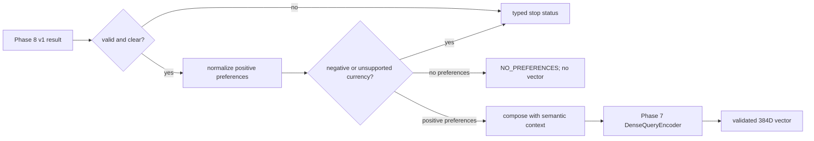

# Phase 9 — Soft Preference Representation

## 1. Executive summary

Phase 9 introduces a deterministic normalizer/composer, a typed result contract, a safety gate for invalid, ambiguous, negative and foreign-currency inputs, and an adapter to the existing Phase 7 BGE query encoder. It does not call Gemini, access the database, apply SQL filters, generate product embeddings, or retrieve products.

**Implementation decision: PASS for Phase 9 component scope.** The Phase 9 suite passed 22/22, repository offline regression passed 398/398 excluding live Gemini tests, and the shared BGE path generated/validated 384D vectors and ran curated comparisons and performance measurements on CUDA. See [evaluation evidence](phase9_preference_evaluation.md). This is not an end-to-end recommendation-quality claim.

## 2. Objective and project context

The proposal's Phase 9 scope is to turn positive soft-preference phrases into a concise semantic query and produce an embedding in the existing product-vector space. Phase 8 production remains the original v1 contract; extraction inaccuracies are upstream and are not counted as Phase 9 embedding errors.

## 3. Reused components and architecture

Phase 9 reuses `QueryUnderstandingResult` / `QueryUnderstandingOutput` from `shopassist.llm.schemas`, `DenseQueryEncoder` from `shopassist.retrieval.semantic`, and the cached `EmbeddingModel` from `shopassist.embeddings.model`. Model identity, query instruction, dimension and normalization come from Phase 7. No new model, vector store or model lifecycle is introduced.



## 4. Input and output contract

Input is a `QueryUnderstandingResult` with nested Schema v1 output. Phase 9 reads `semantic_query`, `soft_preferences`, validity/clarification fields and currency as a safety gate. It does not reinterpret numeric constraints or brand.

Output is `PreferenceRepresentationResult` in `shopassist.preferences.schemas`. A successful result carries normalized phrases, composed query, vector, model and dimension. No-preference and stopped states carry no vector. All statuses are enumerated in [the contract](phase9_preference_contract.md).

## 5. Normalization and composition

Normalization performs NFC canonicalization, trim, whitespace collapse, Unicode case-fold for preference strings, empty removal and stable deduplication. It preserves phrase wording, negation and order. Limits align the Phase 8 list (10 phrases) and 500-character semantic query, with 200 characters per phrase and 1000 characters composed.

Composition is neutral and deterministic: `phrase 1; phrase 2 — semantic query`. This preserves the preference strings and requested product context without generated requirements. The small offline check ranked curated relevant text above paired irrelevant text in 12/12 comparisons. Mean paired margins were 0.3251 for preference-only, 0.4004 for contextual keywords and 0.4034 for Phase 9 composition. The evidence is too small to establish a general winner; context is retained because it is part of the input meaning.

## 6. Embedding integration and compatibility

`PreferenceQueryEncoder` adapts the Phase 7 `DenseQueryEncoder` and its `EmbeddingModel`. It uses `Represent this sentence for searching relevant passages: `, BAAI/bge-small-en-v1.5, dimension 384 and normalized query vectors. The Phase 7 encoder's class cache manages model reuse and device selection (CUDA/MPS/CPU). The adapter checks finite values, shape, nonzero norm and unit normalization before serialization.

`encode_batch()` sends a list through the same underlying `EmbeddingModel.encode_queries()` in one batch; callers can choose batch size. `PreferenceRepresentationService.represent_batch()` currently preserves per-query safety/result states by invoking `represent` per item; it does **not yet coalesce eligible preferences into one model batch**. This is a known performance limitation and the batch API's intended efficiency requires a follow-up before claiming batch throughput.

## 7. Empty preferences, negative intent and errors

An empty normalized list returns `NO_PREFERENCES`, no preference query and no embedding. The base query is preserved for Phase 7's distinct query-encoding path.

The conservative boundary guard prevents obvious `without`, `avoid`, `except`, most `not ...`, and `no less than` phrases from becoming positive evidence. The safe idioms `not too ...`, `not only ...`, and `not necessarily ...` remain verbatim positive soft descriptions. This is intentionally not a general negation parser. Clarification and invalid Phase 8 results stop before model initialization. Foreign currency also stops because catalog prices are INR.

Errors return explicit statuses with exception type only; provider/model detail is not echoed. No raw Gemini diagnostic is included in Phase 9 output.

## 8. Implementation files and examples

New package modules: `src/shopassist/preferences/{__init__.py,normalization.py,query_composer.py,safety.py,embedding.py,schemas.py,service.py}`. Automated tests: `tests/test_preferences.py`.

```python
representation = PreferenceRepresentationService().represent(query_result)
if representation.status == RepresentationStatus.SUCCESS:
    vector = representation.preference_embedding  # 384 finite normalized floats
elif representation.status == RepresentationStatus.NO_PREFERENCES:
    vector = None  # distinct base-query embedding can come from Phase 7
else:
    route_to_clarification_or_error(representation)
```

## 9. Tests and evaluation evidence

The added test module covers normalization, malformed types and limits, composition stability/context, negative guards, vector validity, Phase 8 v1 integration, input immutability, empty preferences, foreign currency, clarification, invalid results, Phase 7 batch adapter conventions and safe embedding-failure diagnostics. It passed 22/22 (20 unit cases, 2 mocked integration checks); repository regression passed 398/398 with the Gemini module excluded. Runtime compatibility, semantic checks and timing are listed in the [evaluation report](phase9_preference_evaluation.md) and `data/interim/phase9/` artifacts.

The model-enabled runtime generated 384D normalized vectors with `BAAI/bge-small-en-v1.5` on the shared Phase 7 query path. Component-level model compatibility is **runtime-verified**; complete catalog and Phase 10 retrieval behavior remain unevaluated.

## 10. Known limitations and Phase 10 interface

The negative guard covers known patterns only; it does not parse arbitrary scope, multilingual negation or implied exclusions. Phase 8 v1 can misextract, and an object passing Pydantic validation may still be semantically wrong. The current batch service makes independent calls. Runtime model loading and 384D output have not been demonstrated in this environment.

Phase 10 may consume `preference_query`, vector, model and dimension only when status is `SUCCESS`. It must check model/dimension/numerics again, use the vector as a soft ranking signal, preserve provenance, and apply hard constraints through a separate validated contract. It must stop on other statuses and must not treat exclusions as preference evidence.

## 11. Reproduction and acceptance

```powershell
python -m pytest tests/test_preferences.py -q
python -m pytest tests/test_semantic_retrieval.py tests/test_query_understanding.py tests/test_phase8_*.py -q
python scripts/evaluate_phase9.py
```

Phase 9 status is **PASS for component scope** based on 22 unit/integration tests, 398 offline regression tests, 384D vector checks, curated semantic pairs and local timings. The service's `represent_batch()` currently processes statuses per item; the encoder adapter itself supports batch encoding. Catalog-scale retrieval and recommendation quality belong to later phases.
